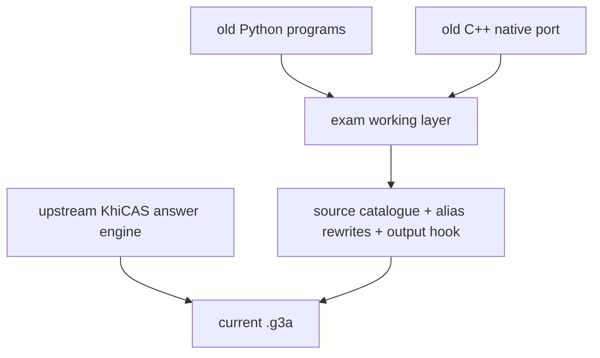

# Feature Parity



## Current State

- Active `.g3a`: source-built KhiCAS UI/engine, packaged with Eigenmath-style icons.
- Old working layer: preserved in `c++/addin/src/device/device_solver.cpp` and `c++/addin/src/modules`.
- `/compile`: builds edited source and publishes `CasioCAS.g3a` at repo root.
- Source hook: `catalogen.cpp` prunes non-A-level catalogue entries, adds old-feature aliases, and adds per-command parameter help.
- Source hook: `main.cc` wraps KhiCAS answers with compact exam-style working lines.

## Old Feature Coverage

| Old feature group | Current KhiCAS equivalent | Working lines status |
|---|---|---|
| simplify/factor/expand/partial fractions | `simplify`, `factor`, `expand`, `partfrac` | source catalogue + working hook |
| solve equations | `solve`, `fsolve`, `csolve`, `linsolve` | source catalogue + working hook |
| compare/transform/match/rewrite | `compare`, `normal`, `solve`, `canonical_form` | source aliases + working hook |
| complete square | `complete_square` -> `canonical_form` | source alias + working hook |
| compose/inverse/domain/range | `subst`, `solve`, `domain`, `tabvar` | source aliases + working hook |
| cartesian/parametric conversion | `eliminate`, param aliases | source aliases + working hook |
| fit constants | `fitconst`, `match` -> `solve` | source aliases + working hook |
| normal/implicit/param/second derivative | `normal_diff`, `implicit_diff`, `param_diff`, `second_diff` | source aliases + working hook |
| integration/DE/param area | `integrate`, `desolve`, `param_area` | source aliases + working hook |
| trig prove/transform/solve/rewrite | `trig_prove`, `trig_transform`, `solve_trig`, `trig_rewrite` | source aliases + working hook |
| SUVAT | `suvat` -> simultaneous equations | source alias + working hook |
| boolean simplify/NAND/NOR/prove | `bool_simplify`, `nand`, `nor`, `prove_bool` | source aliases + working hook |
| stats/probability/regression | KhiCAS stats/proba + old layer tests | source catalogue |
| matrices/vectors | KhiCAS matrix/linalg + old layer tests | source catalogue |
| integer arithmetic | KhiCAS arithmetic + old layer tests | source catalogue |

## Output Rule

Target behaviour:

```text
1. Normalize/input rewrite
2. Method choice
3. Algebraic steps
Answer: simplest exact form
```

Simplification examples:

- `6*3*5x` -> `90*x`
- duplicate answer-only lines rejected
- exact/factorised form preferred before decimal

## Remove Candidates

Removed/hidden from source catalogue:

- Turtle/Logo commands: `avance`, `recule`, `tourne_*`, `crayon`, `efface`, `rectangle_plein`.
- Programming language helpers: `for`, `while`, `if`, `local`, `return`, `debug`, `python`, `python_compat`.
- Low-level drawing commands: `draw_pixel`, `draw_string`, `draw_rectangle`, `draw_polygon`, `rgb`, display colour tokens.
- Advanced university CAS: `laplace`, `ilaplace`, `fourier_an/bn/cn`, `jordan`, `svd`, `gramschmidt`, `cond`, `resultant`.
- Random/data generators: `ranv`, `ranm`, `rand`, `randint` unless stats simulation is wanted.
- Complex-only extras: `residue`, `cfactor`, `cpartfrac` unless complex roots are required.

Old-feature aliases added to source catalogue:

- `complete_square(expr,[x])` -> `canonical_form`
- `compose(f,g,[x])` -> `subst`
- `compare(expr1,expr2)` -> KhiCAS `compare`
- `cartesian([x(t),y(t)],t)` -> `eliminate`
- `domain(expr,[x])`, `range(expr,[x])` -> `domain`, `tabvar`
- `fitconst(equations,vars)`, `match(expr,form)` -> `solve`
- `normal_diff`, `implicit_diff`, `param_diff`, `param_second_diff`, `second_diff`, `tangent_line`
- `integrate`, `de_solve`, `param_area`
- `inverse(f(x))` -> solve inverse relation
- `rewrite(expr,target)`, `transform(expr,[form])`, `xform(expr,target)`
- `solve_trig`, `trig_prove`, `trig_transform`, `trig_rewrite`
- `suvat(equations,vars)` -> solve SUVAT equations
- `bool_simplify(expr)`, `nand(a,b)`, `nor(a,b)`, `prove_bool(lhs,rhs)`

Keep unless you say otherwise:

- core algebra/solve/calculus/trig
- matrix/vector basics
- stats/probability/regression/plots
- exact arithmetic/number theory basics
