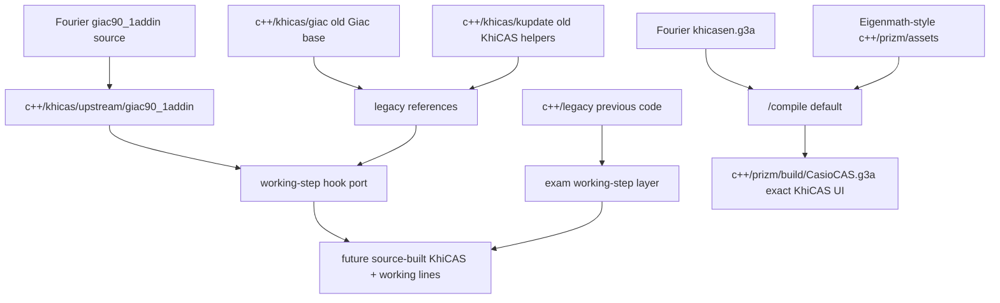
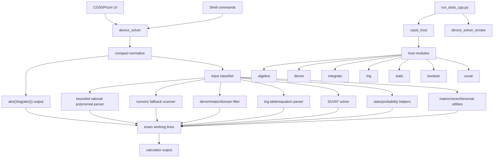
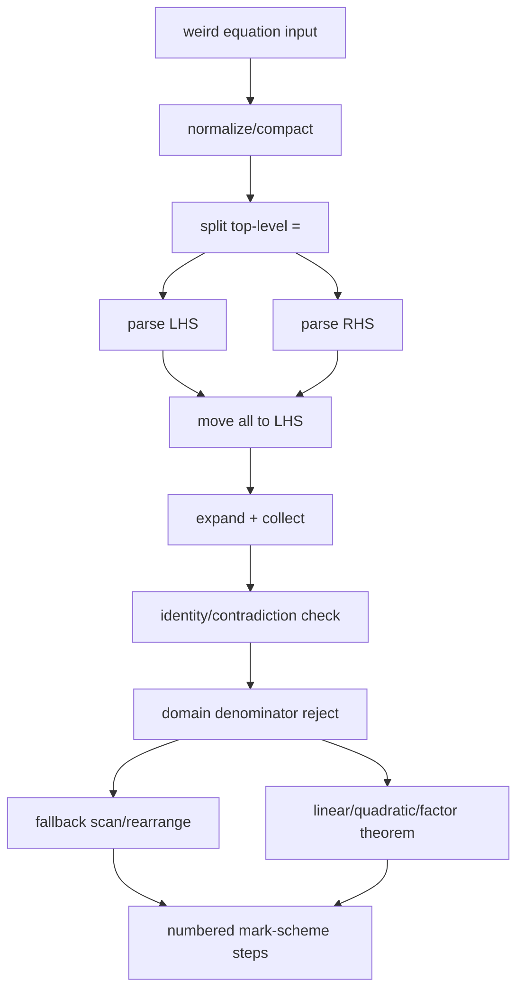
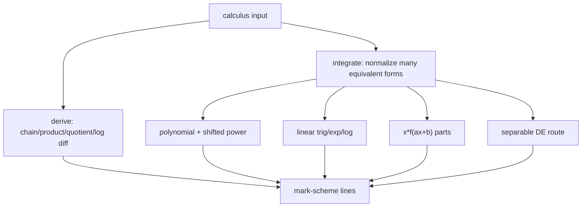
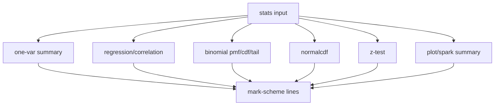
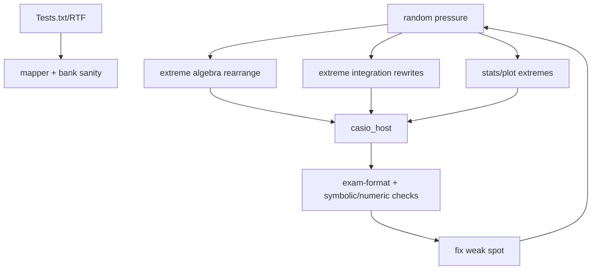

# C++ Solver Graph

```mermaid
graph TD
  Up["Fourier giac90_1addin source"] --> Exact["c++/khicas/upstream/giac90_1addin"]
  Ref["Fourier khicasen.g3a"] --> Build["/compile default"]
  Icons["Eigenmath-style c++/prizm/assets"] --> Build
  Exact --> Port["working-step hook port"]
  KH["c++/khicas/giac old Giac base"] --> OldRefs["legacy references"]
  KU["c++/khicas/kupdate old KhiCAS helpers"] --> OldRefs
  OldRefs --> Port
  Legacy["c++/legacy previous code"] --> WorkSteps["exam working-step layer"]
  Build --> G3A["c++/prizm/build/CasioCAS.g3a exact KhiCAS UI"]
  Port --> Future["future source-built KhiCAS + working lines"]
  WorkSteps --> Future
```

```mermaid
graph TD
  UI["CG50/Prizm UI"] --> DS["device_solver"]
  Shell["Shell commands"] --> DS
  DS --> Norm["compact normalize"]
  Norm --> Abs["abs()/log(abs()) output"]
  Norm --> Cls["input classifier"]
  Cls --> Poly["bounded rational polynomial parser"]
  Cls --> Num["numeric fallback scanner"]
  Cls --> Rat["denominator/domain filter"]
  Cls --> Trig["trig table/equation parser"]
  Cls --> Suvat["SUVAT solver"]
  Cls --> Stats["stats/probability helpers"]
  Cls --> Util["matrix/vector/binomial utilities"]
  Abs --> Work["exam working lines"]
  Poly --> Work["exam working lines"]
  Num --> Work
  Rat --> Work
  Trig --> Work
  Suvat --> Work
  Stats --> Work
  Util --> Work
  Work --> Screen["calculator output"]

  Host["casio_host"] --> Mods["host modules"]
  Mods --> Alg["algebra"]
  Mods --> Der["derive"]
  Mods --> Int["integrate"]
  Mods --> TrigH["trig"]
  Mods --> StatsH["stats"]
  Mods --> Bool["boolean"]
  Mods --> SuvatH["suvat"]
  Tests["run_tests_cpp.py"] --> Host
  Tests --> Smoke["device_solver_smoke"]
```

```mermaid
graph TD
  In["weird equation input"] --> N["normalize/compact"]
  N --> E["split top-level ="]
  E --> L["parse LHS"]
  E --> R["parse RHS"]
  L --> M["move all to LHS"]
  R --> M
  M --> C["expand + collect"]
  C --> ID["identity/contradiction check"]
  ID --> Den["domain denominator reject"]
  Den --> S["linear/quadratic/factor theorem"]
  Den --> F["fallback scan/rearrange"]
  F --> W
  S --> W["numbered mark-scheme steps"]
```

```mermaid
graph TD
  Calc["calculus input"] --> D["derive: chain/product/quotient/log diff"]
  Calc --> I["integrate: normalize many equivalent forms"]
  I --> P["polynomial + shifted power"]
  I --> T["linear trig/exp/log"]
  I --> B["x*f(ax+b) parts"]
  I --> DE["separable DE route"]
  D --> W["mark-scheme lines"]
  P --> W
  T --> W
  B --> W
  DE --> W
```

```mermaid
graph TD
  S["stats input"] --> O["one-var summary"]
  S --> R["regression/correlation"]
  S --> Bn["binomial pmf/cdf/tail"]
  S --> N["normalcdf"]
  S --> Z["z-test"]
  S --> P["plot/spark summary"]
  O --> W["mark-scheme lines"]
  R --> W
  Bn --> W
  N --> W
  Z --> W
  P --> W
```

```mermaid
graph TD
  RT["Tests.txt/RTF"] --> Map["mapper + bank sanity"]
  Rand["random pressure"] --> Alg["extreme algebra rearrange"]
  Rand --> Int["extreme integration rewrites"]
  Rand --> Stats["stats/plot extremes"]
  Alg --> Host["casio_host"]
  Int --> Host
  Stats --> Host
  Host --> Gate["exam-format + symbolic/numeric checks"]
  Gate --> Fix["fix weak spot"]
  Fix --> Rand
```
