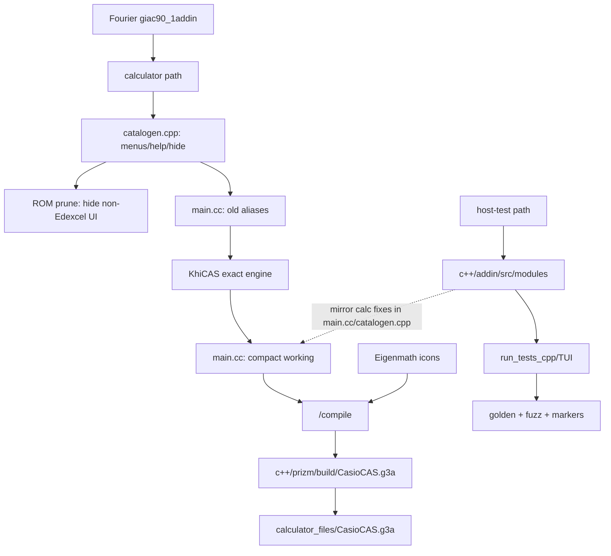
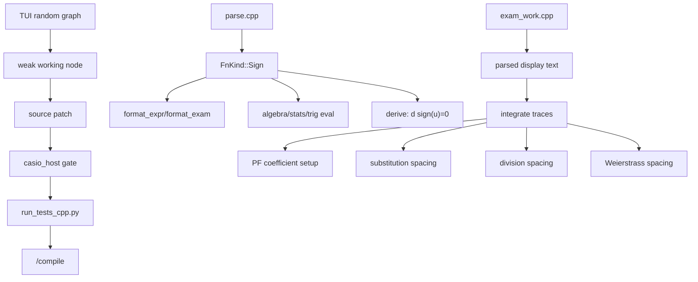
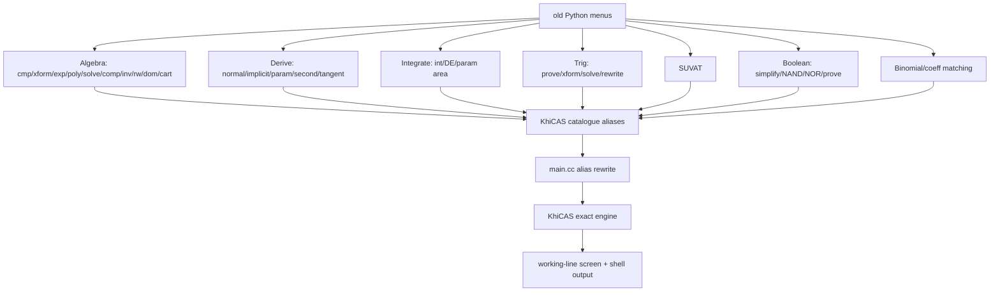
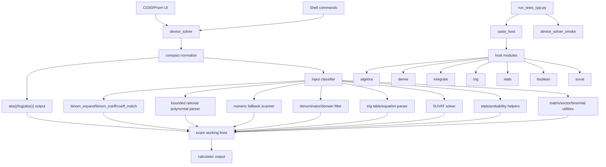
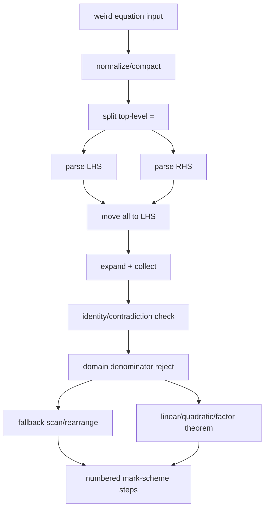
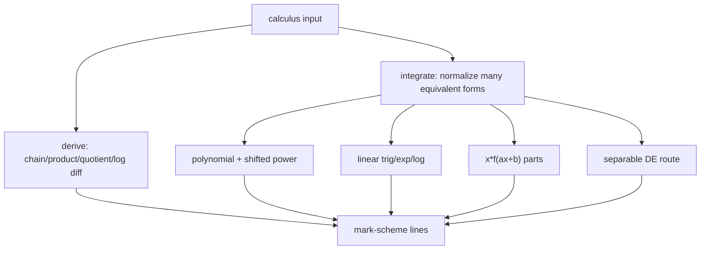
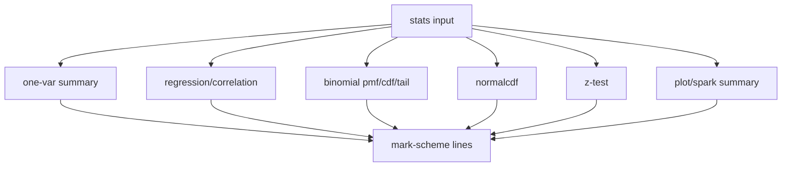
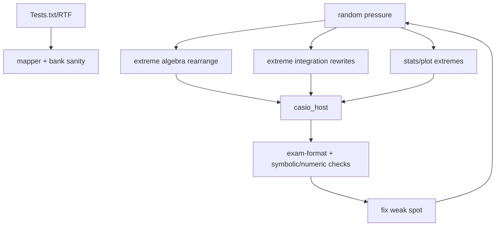

# C++ Solver Graph

```mermaid
graph TD
  Src["Fourier giac90_1addin"] --> Calc["calculator path"]
  Calc --> Cat["catalogen.cpp: menus/help/hide"]
  Cat --> Prune["ROM prune: hide non-Edexcel UI"]
  Cat --> Alias["main.cc: old aliases"]
  Alias --> Giac["KhiCAS exact engine"]
  Giac --> Work["main.cc: compact working"]
  Work --> Build["/compile"]
  Build --> G3A["c++/prizm/build/CasioCAS.g3a"]
  G3A --> Transfer["calculator_files/CasioCAS.g3a"]
  Icons["Eigenmath icons"] --> Build

  Host["host-test path"] --> Mods["c++/addin/src/modules"]
  Mods --> TUI["run_tests_cpp/TUI"]
  TUI --> Gates["golden + fuzz + markers"]
  Mods -. "mirror calc fixes in main.cc/catalogen.cpp" .-> Work
```

```mermaid
graph TD
  Rand["TUI random graph"] --> Weak["weak working node"]
  Weak --> Patch["source patch"]
  Patch --> Host["casio_host gate"]
  Host --> Full["run_tests_cpp.py"]
  Full --> Build["/compile"]

  Parse["parse.cpp"] --> Sign["FnKind::Sign"]
  Sign --> Fmt["format_expr/format_exam"]
  Sign --> Eval["algebra/stats/trig eval"]
  Sign --> Der["derive: d sign(u)=0"]

  Exam["exam_work.cpp"] --> Friendly["parsed display text"]
  Friendly --> Int["integrate traces"]
  Int --> PF["PF coefficient setup"]
  Int --> Sub["substitution spacing"]
  Int --> Div["division spacing"]
  Int --> Wei["Weierstrass spacing"]
```

```mermaid
graph TD
  OldPy["old Python menus"] --> Alg["Algebra: cmp/xform/exp/poly/solve/comp/inv/rw/dom/cart"]
  OldPy --> Der["Derive: normal/implicit/param/second/tangent"]
  OldPy --> Int["Integrate: int/DE/param area"]
  OldPy --> Tri["Trig: prove/xform/solve/rewrite"]
  OldPy --> Suv["SUVAT"]
  OldPy --> Bool["Boolean: simplify/NAND/NOR/prove"]
  OldPy --> Bin["Binomial/coeff matching"]
  Alg --> Cat["KhiCAS catalogue aliases"]
  Der --> Cat
  Int --> Cat
  Tri --> Cat
  Suv --> Cat
  Bool --> Cat
  Bin --> Cat
  Cat --> Rew["main.cc alias rewrite"]
  Rew --> Giac["KhiCAS exact engine"]
  Giac --> Work["working-line screen + shell output"]
```

```mermaid
graph TD
  UI["CG50/Prizm UI"] --> DS["device_solver"]
  Shell["Shell commands"] --> DS
  DS --> Norm["compact normalize"]
  Norm --> Abs["abs()/log(abs()) output"]
  Norm --> Cls["input classifier"]
  Cls --> Binom["binom_expand/binom_coeff/coeff_match"]
  Cls --> Poly["bounded rational polynomial parser"]
  Cls --> Num["numeric fallback scanner"]
  Cls --> Rat["denominator/domain filter"]
  Cls --> Trig["trig table/equation parser"]
  Cls --> Suvat["SUVAT solver"]
  Cls --> Stats["stats/probability helpers"]
  Cls --> Util["matrix/vector/binomial utilities"]
  Abs --> Work["exam working lines"]
  Poly --> Work["exam working lines"]
  Num --> Work
  Rat --> Work
  Trig --> Work
  Suvat --> Work
  Stats --> Work
  Util --> Work
  Binom --> Work
  Work --> Screen["calculator output"]

  Host["casio_host"] --> Mods["host modules"]
  Mods --> Alg["algebra"]
  Mods --> Der["derive"]
  Mods --> Int["integrate"]
  Mods --> TrigH["trig"]
  Mods --> StatsH["stats"]
  Mods --> Bool["boolean"]
  Mods --> SuvatH["suvat"]
  Tests["run_tests_cpp.py"] --> Host
  Tests --> Smoke["device_solver_smoke"]
```

```mermaid
graph TD
  In["weird equation input"] --> N["normalize/compact"]
  N --> E["split top-level ="]
  E --> L["parse LHS"]
  E --> R["parse RHS"]
  L --> M["move all to LHS"]
  R --> M
  M --> C["expand + collect"]
  C --> ID["identity/contradiction check"]
  ID --> Den["domain denominator reject"]
  Den --> S["linear/quadratic/factor theorem"]
  Den --> F["fallback scan/rearrange"]
  F --> W
  S --> W["numbered mark-scheme steps"]
```

```mermaid
graph TD
  Calc["calculus input"] --> D["derive: chain/product/quotient/log diff"]
  Calc --> I["integrate: normalize many equivalent forms"]
  I --> P["polynomial + shifted power"]
  I --> T["linear trig/exp/log"]
  I --> B["x*f(ax+b) parts"]
  I --> DE["separable DE route"]
  D --> W["mark-scheme lines"]
  P --> W
  T --> W
  B --> W
  DE --> W
```

```mermaid
graph TD
  S["stats input"] --> O["one-var summary"]
  S --> R["regression/correlation"]
  S --> Bn["binomial pmf/cdf/tail"]
  S --> N["normalcdf"]
  S --> Z["z-test"]
  S --> P["plot/spark summary"]
  O --> W["mark-scheme lines"]
  R --> W
  Bn --> W
  N --> W
  Z --> W
  P --> W
```

```mermaid
graph TD
  RT["Tests.txt/RTF"] --> Map["mapper + bank sanity"]
  Rand["random pressure"] --> Alg["extreme algebra rearrange"]
  Rand --> Int["extreme integration rewrites"]
  Rand --> Stats["stats/plot extremes"]
  Alg --> Host["casio_host"]
  Int --> Host
  Stats --> Host
  Host --> Gate["exam-format + symbolic/numeric checks"]
  Gate --> Fix["fix weak spot"]
  Fix --> Rand
```
