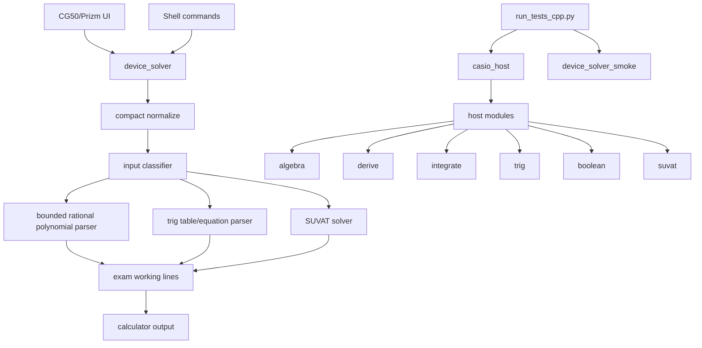
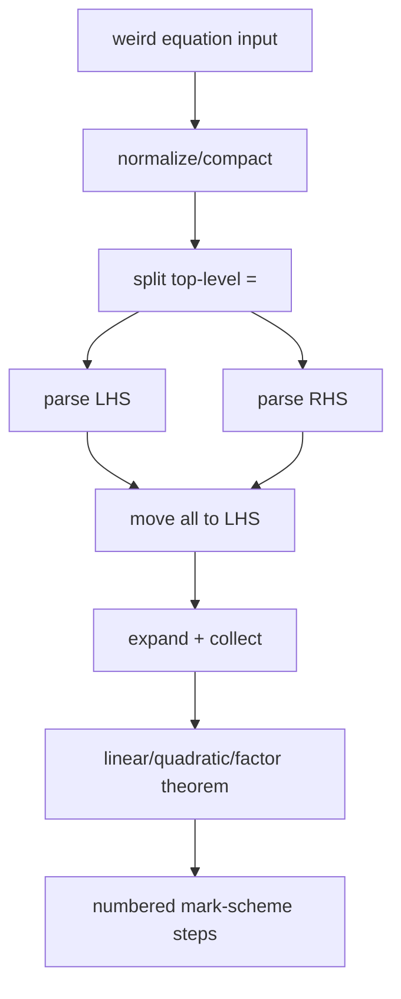

# C++ Solver Graph

```mermaid
graph TD
  UI["CG50/Prizm UI"] --> DS["device_solver"]
  Shell["Shell commands"] --> DS
  DS --> Norm["compact normalize"]
  Norm --> Cls["input classifier"]
  Cls --> Poly["bounded rational polynomial parser"]
  Cls --> Trig["trig table/equation parser"]
  Cls --> Suvat["SUVAT solver"]
  Poly --> Work["exam working lines"]
  Trig --> Work
  Suvat --> Work
  Work --> Screen["calculator output"]

  Host["casio_host"] --> Mods["host modules"]
  Mods --> Alg["algebra"]
  Mods --> Der["derive"]
  Mods --> Int["integrate"]
  Mods --> TrigH["trig"]
  Mods --> Bool["boolean"]
  Mods --> SuvatH["suvat"]
  Tests["run_tests_cpp.py"] --> Host
  Tests --> Smoke["device_solver_smoke"]
```

```mermaid
graph TD
  In["weird equation input"] --> N["normalize/compact"]
  N --> E["split top-level ="]
  E --> L["parse LHS"]
  E --> R["parse RHS"]
  L --> M["move all to LHS"]
  R --> M
  M --> C["expand + collect"]
  C --> S["linear/quadratic/factor theorem"]
  S --> W["numbered mark-scheme steps"]
```

