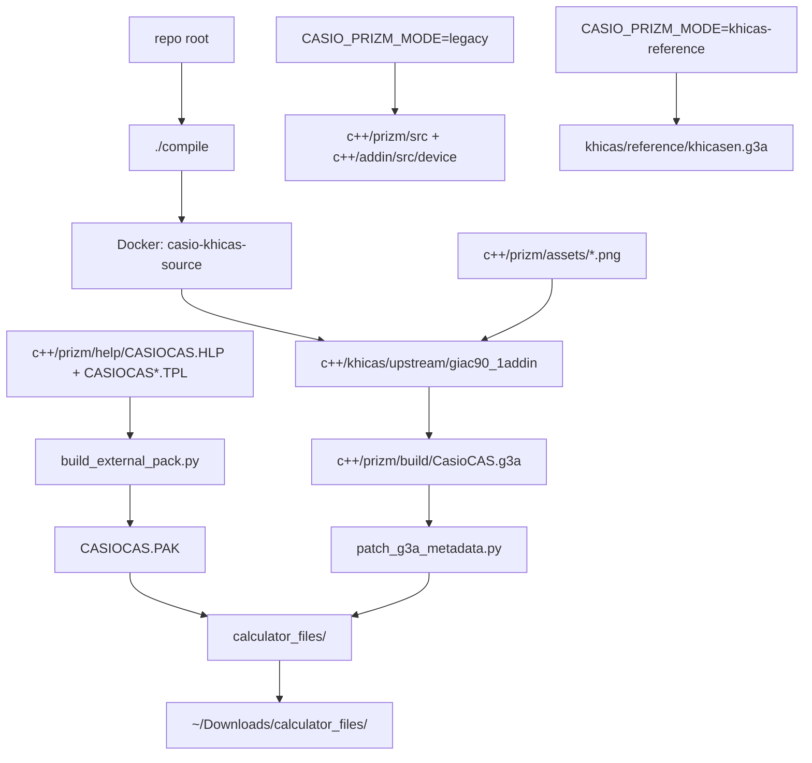
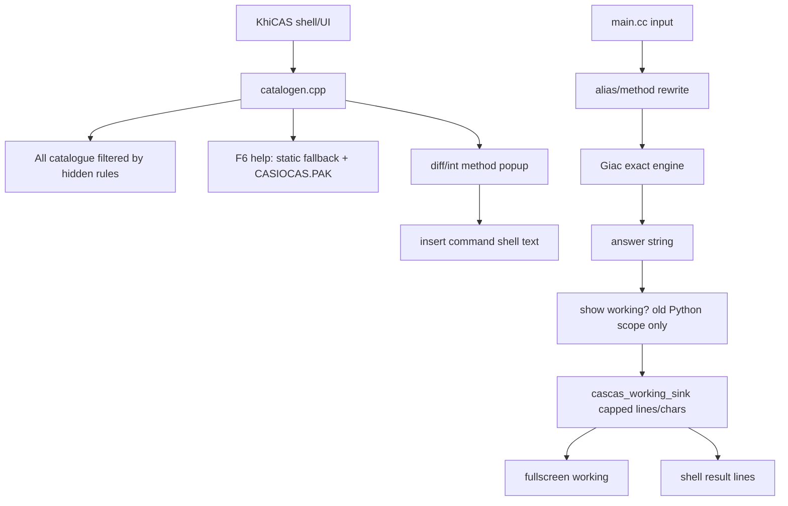
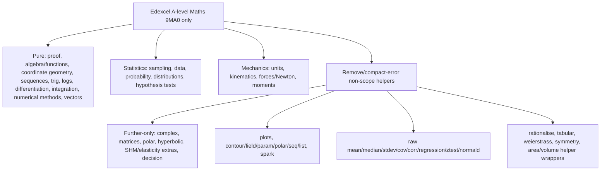
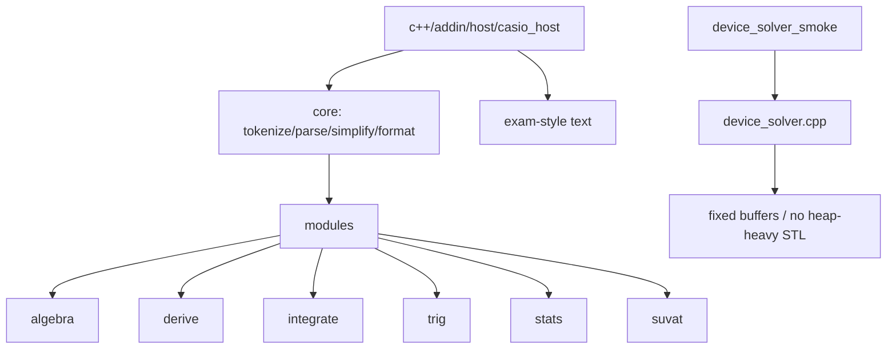
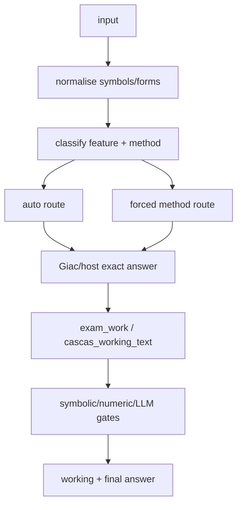
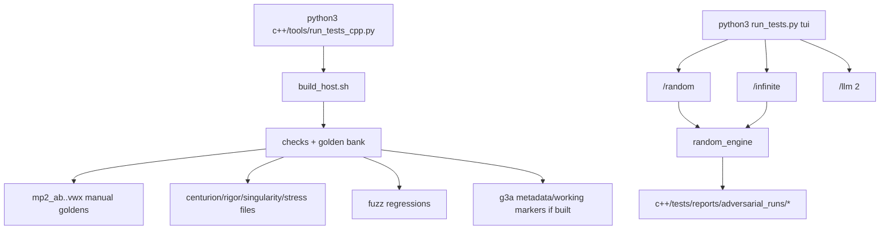
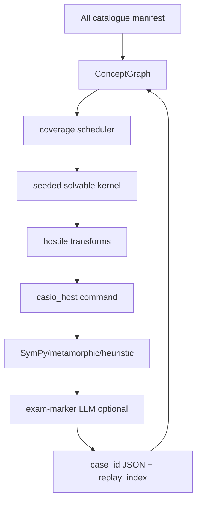
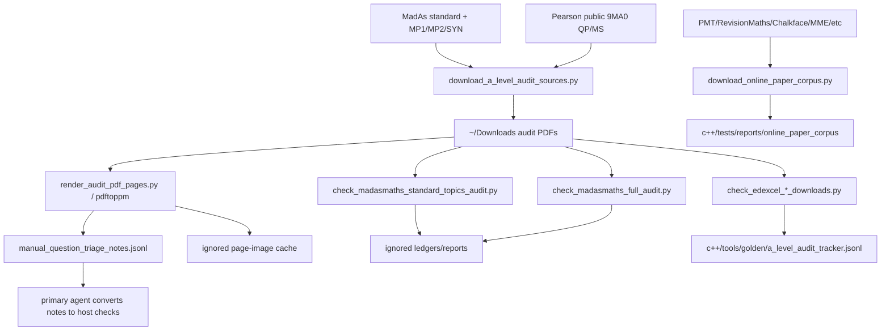
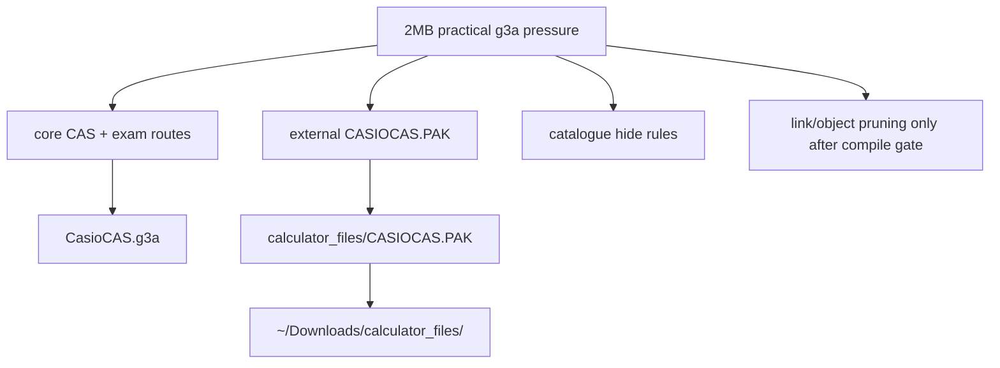
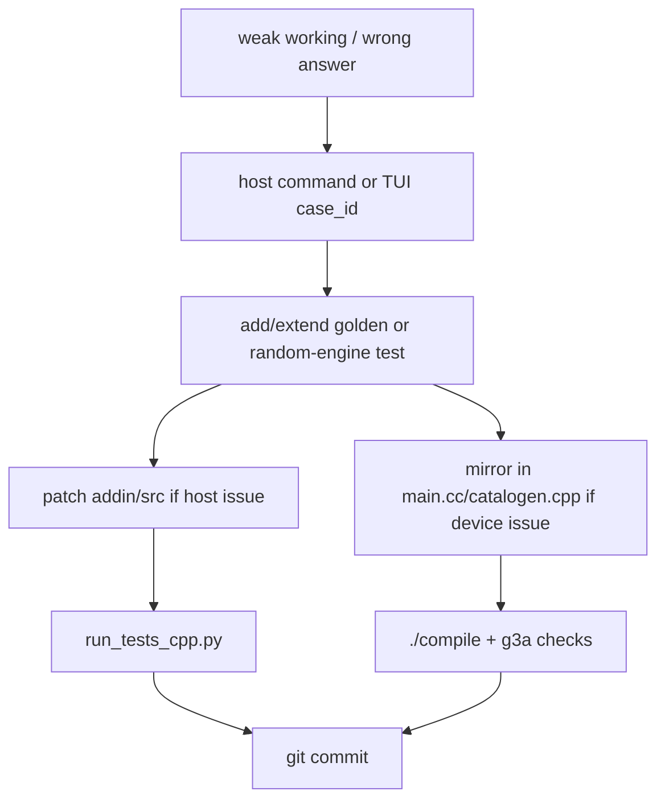

# CasioCAS Project Graph

Use this file as the compact AI map. Prefer this over rereading the repo from
scratch.

## Build Paths



Patch production calculator behavior in:
- `c++/khicas/upstream/giac90_1addin/main.cc`
- `c++/khicas/upstream/giac90_1addin/catalogen.cpp`
- `c++/prizm/help/CASIOCAS.HLP` for F6 help source
- `c++/prizm/help/CASIOCAS*.TPL` for offloaded working/menu templates

Patch host/golden behavior in:
- `c++/addin/src/core/*`
- `c++/addin/src/modules/*`
- `c++/addin/src/device/*`

Important: host module fixes are not automatically calculator fixes unless
mirrored into the KhiCAS source path.

## Calculator Runtime



Working output scope:
- yes: `diff`, `implicit_diff`, `param_diff`, `integrate`, `defint`, `de_solve`,
  `solve`, `solve_trig`, `domain`, `range`, `compare`, `rewrite`, `fitconst`,
  Python-parity maths helpers
- no/answer-first: most raw KhiCAS commands such as `tcollect`, `texpand`,
  `factor`, `simplify`, unless wrapped by project routes

## Syllabus Scope



## Host Test Engine



Host output quality rules:
- final answer line should be maths only
- no `Chk:`, `Answer: int(...)`, `Answer: d/dx(...)`, parser tracebacks, or
  generic calculator-debug text
- full working only where project scope requires it
- stats scalar args accept A-level standard-error arithmetic such as
  `sqrt(4^2/10+6^2/15)` without re-adding removed raw stats helpers
- latest MadAsMaths audit coverage: `254/462` PDFs covered, `6090` manual
  standard cases

## Working Logic



High-value step generators:
- algebra: expand, factor, collect, complete square, clear denominators,
  equate coefficients, partial fractions
- differentiation: first principles, chain, product, quotient, logdiff,
  implicit, parametric, second derivative
- integration: direct, reverse chain, substitution, parts, partial fractions,
  trig identities, definite-integral evaluation, DE separation
- trig: sin/cos/tan rewrites, R-form, sum/product identities, power reduction,
  bounded/general solution checks
- domain/range: denominator/radical/log/inverse-trig guards, sampling only as
  support

## Test Gates



Quick commands:

```bash
./c++/tools/build_host.sh
python3 c++/tools/run_tests_cpp.py
./compile
python3 run_tests.py tui
```

## Adversarial Random Engine



Node key:
`function | parameter_signature | method | topic | transform_chain | difficulty | oracle`

Random graph resets each `/random` or `/infinite` session.

## Audit Corpus



Current policy:
- source PDFs/images stay out of git
- tracked ledgers contain only compact manual verdicts/commands
- parallel triage rows are append-only evidence, not executable proof
- failed third-party links are recorded, but Pearson/MadAs required corpus must be complete
- latest MadAs coverage: 462 downloaded question PDFs, 266 covered, 196 gaps

## ROM / Storage



Safe-ish size levers:
- keep verbose help/examples/templates in `CASIOCAS.PAK` via `CASIOCAS.HLP`/`CASIOCAS*.TPL` sources
- hide/remove non-scope UI surfaces first
- remove linked legacy objects only one at a time with full gates
- preserve core Giac paths used by solve/diff/int/trig/stats

## Patch Rules



Never claim calculator behavior from host-only evidence. If the `.g3a` matters,
run `./compile` and `check_g3a_*`.
