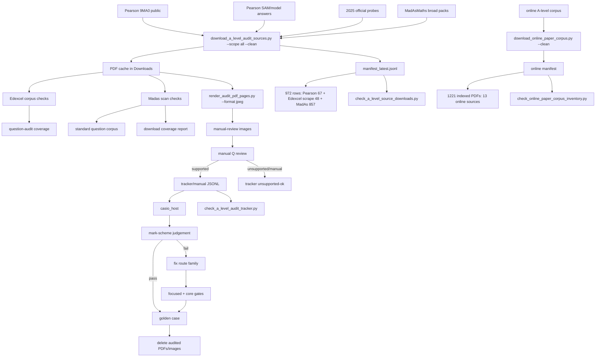

# A-Level Audit Flow

Latest refresh: 2026-05-25.

- `check_a_level_source_downloads.py`: `rows=972`, no failures.
- `check_edexcel_public_paper_corpus.py`: `54` official Pearson 9MA0 PDFs, `27` question papers + `27` mark schemes.
- `check_edexcel_question_audit_coverage.py`: `27` official question papers have tracker rows for all inferred questions.
- `check_online_paper_corpus_inventory.py`: `1222` indexed PDFs, `0` cached PDF files after cleanup, `1157` text extracts, `6766` question-marker hits, `11` skipped known-dead/non-paper links.
- `check_a_level_audit_tracker.py`: `1344` reviewed rows, `1159` host-pass, `185` unsupported-ok, `3009` host runs.
- `check_madasmaths_standard_question_corpus.py`: `4554` rows, `5896` manual cases, no failures.
- `check_madasmaths_download_coverage.py`: `462` downloaded MadAsMaths question PDFs, `226` covered, `236` still gap-listed for future manual audit.
- Current working help/templates are external in `c++/prizm/help/*.HLP/*.TPL` and packed to `CASIOCAS.PAK`; keep verbose help out of `.g3a`.
