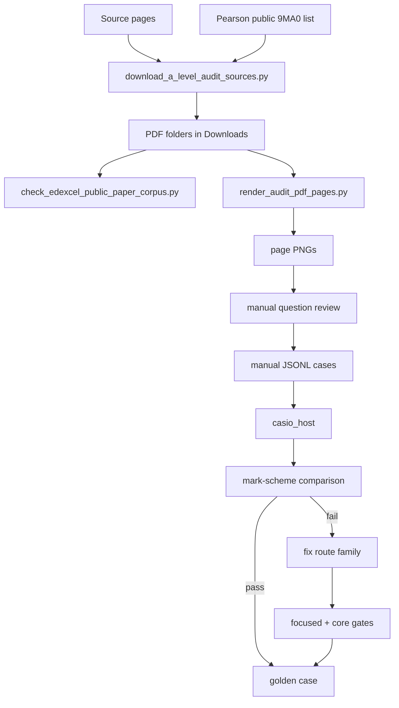

# A-Level Audit Flow

```mermaid
graph TD
  S["Source pages"] --> D["download_a_level_audit_sources.py"]
  O["Pearson public 9MA0 list"] --> D
  D --> P["PDF folders in Downloads"]
  P --> V["check_edexcel_public_paper_corpus.py"]
  P --> R["render_audit_pdf_pages.py"]
  R --> I["page PNGs"]
  I --> M["manual question review"]
  M --> J["manual JSONL cases"]
  J --> H["casio_host"]
  H --> C["mark-scheme comparison"]
  C -->|pass| G["golden case"]
  C -->|fail| F["fix route family"]
  F --> T["focused + core gates"]
  T --> G
```
