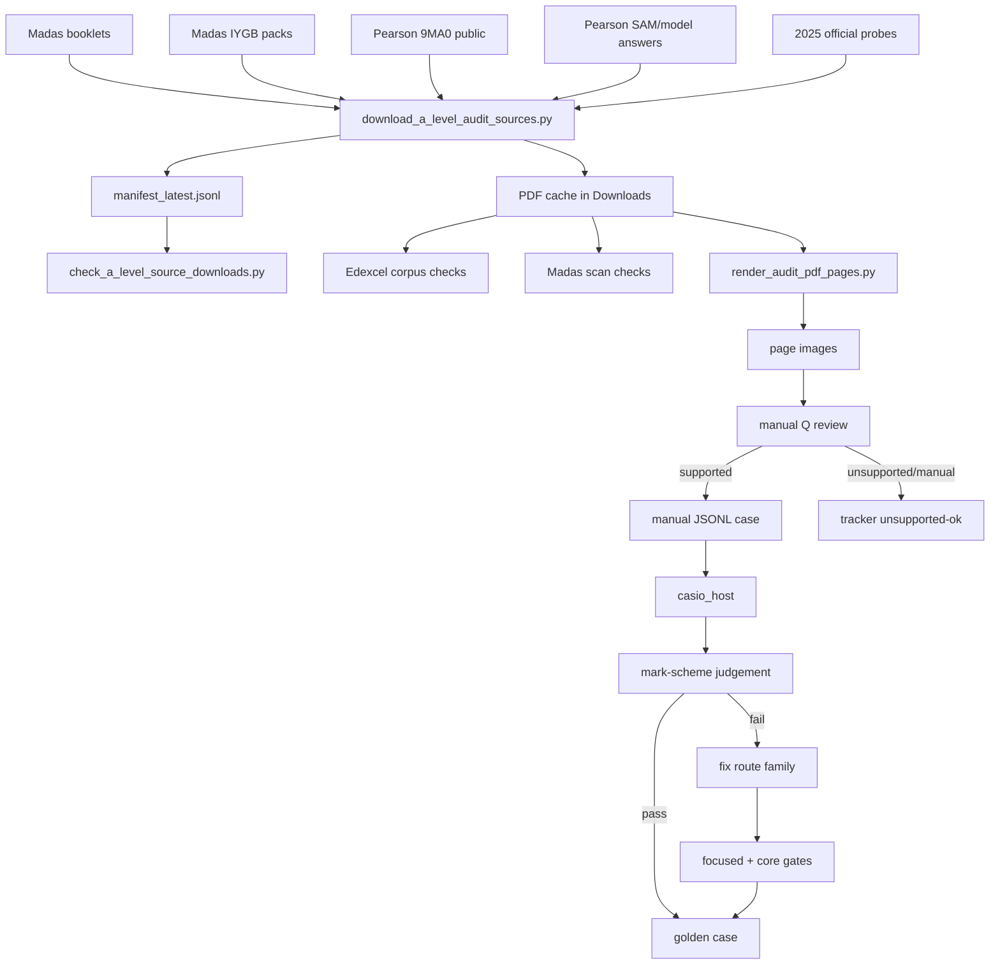

# A-Level Audit Flow

```mermaid
graph TD
  M1["Madas booklets"] --> D["download_a_level_audit_sources.py"]
  M2["Madas IYGB packs"] --> D
  E1["Pearson 9MA0 public"] --> D
  E2["Pearson SAM/model answers"] --> D
  E3["2025 official probes"] --> D
  D --> P["PDF cache in Downloads"]
  D --> X["manifest_latest.jsonl"]
  X --> V["check_a_level_source_downloads.py"]
  P --> E["Edexcel corpus checks"]
  P --> S["Madas scan checks"]
  P --> R["render_audit_pdf_pages.py"]
  R --> I["page images"]
  I --> Q["manual Q review"]
  Q -->|supported| J["manual JSONL case"]
  Q -->|unsupported/manual| U["tracker unsupported-ok"]
  J --> H["casio_host"]
  H --> C["mark-scheme judgement"]
  C -->|pass| G["golden case"]
  C -->|fail| F["fix route family"]
  F --> T["focused + core gates"]
  T --> G
```
