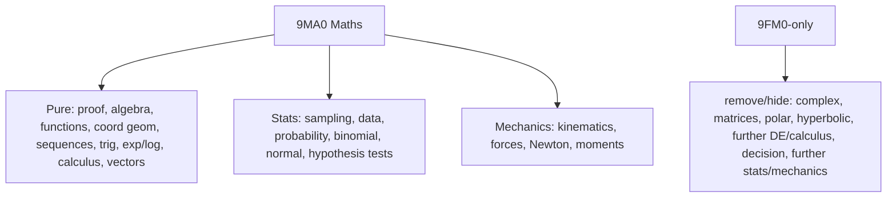

# CasioCAS 9MA0 Function Inventory

Sources checked:
- Pearson Edexcel A-level Mathematics 9MA0 specification, Issue 4: https://qualifications.pearson.com/content/dam/pdf/A%20Level/Mathematics/2017/specification-and-sample-assesment/a-level-l3-mathematics-specification-issue4.pdf
- Pearson Edexcel A-level Further Mathematics 9FM0 specification: https://qualifications.pearson.com/content/dam/pdf/A%20Level/Mathematics/2017/specification-and-sample-assesment/a-level-l3-further-mathematics-specification.pdf

Scope:

Legend:
- Origin `KhiCAS`: original KhiCAS/CasioCAS CAS/parser/catalogue.
- Origin `CasioCAS`: added modified layer in `c++/addin/src` or `giac90_1addin/main.cc`.
- Origin `Both`: original KhiCAS operation exists, but current project wraps A-level cases for working.
- Working `yes`: method-mark working intended.
- Working `partial`: working for supported A-level routes; fallback is compact answer/error.
- Working `no`: utility/obvious/programming or native answer-only.
- Working `blocked`: removed or hidden by 9MA0 scope.

## Core Shell And Parser

| Surface | 9MA0 | Origin | Working | Notes |
|---|---:|---|---|---|
| free expression parse/eval | keep | KhiCAS | no | Native compact result. |
| equation input `lhs=rhs` | keep | Both | partial | Routed to algebra/trig working where recognised. |
| lists/basic syntax | keep | KhiCAS | no | Needed for input/forms; list/stat list ops mostly not a target. |
| constants `pi,e,inf` | keep | KhiCAS | no | `inf` needed for limits/improper integrals. |
| arithmetic operators `+ - * / ^` | keep | KhiCAS | no | Base parser. |
| comparisons `< <= == != >= >` | keep | KhiCAS | no | Program/condition syntax. |
| boolean `and/or/not/!,&,|,~,=>` | hide | KhiCAS | no | Parser syntax retained; Boolean helper menu/routes removed from 9MA0 app surface. |
| assignment `:=`, store `=>` | keep | KhiCAS | no | Shell/program utility. |
| program tokens `function`, `si`, `pour`, `tantque`, `_`, `\\`, `%` | hide | KhiCAS | no | Catalogue hidden where possible; parser retained. |

## Algebra And Functions

| Surface | 9MA0 | Origin | Working | Notes |
|---|---:|---|---|---|
| `simplify(expr[,method])` | keep | Both | partial | Collect/log/trig/radical routes when recognised. |
| `expand(expr)` | keep | Both | yes | Polynomial/binomial expansion routes. |
| `factor(expr[,x])` | keep | Both | partial | Polynomial factor steps where supported. |
| `poly(expr[,x])` | keep | CasioCAS | partial | Alias/working around factor/polynomial form. |
| `partfrac(expr,x)` / `pf(...)` | keep | Both | yes | Partial fraction setup/coefficient working. |
| `complete_square(expr[,x])` / `comp_square(...)` | keep | CasioCAS | yes | Quadratic completion and vertex form. |
| `solve(eq,x[,method])` | keep | Both | partial | Linear/quadratic/log/exp/surd/rational/trig delegates. |
| `solve_by(eq,x,method)` | typed-hidden | CasioCAS | yes | Alias to method-forced `solve`. |
| `fsolve(eq,x=a..b)` | keep | KhiCAS | no | Native numeric solve; no fake working. |
| `compare(expr1,expr2)` | keep | CasioCAS | yes | Equivalence proof lines. |
| `match(expr,form)` | keep | CasioCAS | yes | Coefficient/form matching. |
| `coeff_match(expr,form,vars[,x])` | typed-hidden | CasioCAS | yes | Hidden catalogue, still accepted by alias layer. |
| `fitconst(equations,vars)` | keep | CasioCAS | yes | Solves unknown constants by substitution/coefficient matching. |
| `xform(expr,target)` / `transform(expr,target)` | keep | CasioCAS | yes | Rearrangement/proof style transform. |
| `rewrite(expr[,target])` | keep | CasioCAS | partial | Radical, reciprocal, trig/log rewrites; compact fallback. |
| `subst(a,b=c)` | keep | KhiCAS | no | Direct substitution; usually obvious. |
| `coeff(p,x,n)` | keep | KhiCAS | no | Coefficient extraction; obvious result. |
| `compose(f,g)` | typed-hidden | CasioCAS | yes | Function composition working. |
| `inverse(f[,domain])` | typed-hidden | CasioCAS | yes | Inverse function working/domain notes. |
| `domain(expr[,x,lo,hi])` | keep | CasioCAS | partial | Compact domain lines; no long prose target. |
| `range(expr[,x,lo,hi])` | keep | CasioCAS | partial | Compact range lines; no long prose target. |
| `period(expr)` | typed-hidden | CasioCAS | partial | Trig period where recognised. |
| `abs(x)`, `sign(x)` | keep | KhiCAS | no | Native scalar utilities; used inside routes. |
| `evalat(expr,x=a)` | typed-hidden | CasioCAS | no | Direct value substitution. |

## Binomial And Series

| Surface | 9MA0 | Origin | Working | Notes |
|---|---:|---|---|---|
| `binom_expand(expr)` | keep | CasioCAS | yes | Binomial expansion route. |
| `binom_coeff(expr,x,k)` | keep | CasioCAS | yes | Coefficient extraction with expansion/binomial terms. |
| `binomial(expr)` / `series(expr,...)` | keep | CasioCAS | yes | 9MA0 binomial series for small powers/degree. |
| `maclaurin(...)`, `taylor(...)` | blocked | CasioCAS/KhiCAS | blocked | 9FM0-style general series; returns compact unsupported/removed. |

## Trigonometry

| Surface | 9MA0 | Origin | Working | Notes |
|---|---:|---|---|---|
| `solve_trig(eq,[var,lo,hi,max,method])` | typed-hidden | CasioCAS | yes | CAST, bounded/general, R-form, identity routes. |
| `solve_trig_by(eq,var,method)` | typed-hidden | CasioCAS | yes | Method-forced trig solve alias. |
| `trig_prove(lhs,rhs)` | keep | CasioCAS | yes | Identity proof/equivalence lines. |
| `trig_rewrite(expr,target)` | keep | CasioCAS | yes | Identity rewrite route. |
| `trig_transform(expr,target)` | typed-hidden | CasioCAS | yes | Alias to trig transform/proof route. |
| `trigcos(expr/eq)` | keep | Both | partial | Cosine-basis rewrite/solve. |
| `trigsin(expr/eq)` | keep | Both | partial | Sine-basis rewrite/solve. |
| `trigtan(expr/eq)` | keep | Both | partial | Tangent-basis rewrite/solve. |
| `tcollect(expr)`, `texpand(expr)`, `tlin(expr)` | keep | KhiCAS | partial | Native trig manipulation; wrapped in some routes. |
| `sin,cos,tan,asin,acos,atan,sec,csc/cosec,cot` | keep | Both | partial | Parser/display and calculus/trig routes. |
| hyperbolic/inverse hyperbolic | blocked | KhiCAS | blocked | Removed/hidden by 9MA0 scope. |

## Differentiation

| Surface | 9MA0 | Origin | Working | Notes |
|---|---:|---|---|---|
| `diff(f,x[,n,method])` / `derive(...)` | keep | Both | yes | Chain/product/quotient/logdiff/general rule lines. |
| `normal_diff(expr[,x])` | typed-hidden | CasioCAS | yes | First derivative alias. |
| `implicit_diff(eq,[x,y])` | keep | CasioCAS | yes | Differentiate both sides, collect `dy/dx`. |
| `param_diff([x(t),y(t)],t)` | keep | CasioCAS | yes | `dx/dt`, `dy/dt`, `dy/dx`, optional second derivative. |
| `tangent_line(expr,x,x0)` | typed-hidden | CasioCAS/KhiCAS | yes | Tangent line route. |
| first principles derivative | typed method | CasioCAS | yes | Host method `first_principles`. |
| second/third derivative | typed method | CasioCAS | yes | `method=second`, `method=third`; third is not a 9MA0 priority. |
| related-rate algebra checks | keep | CasioCAS | partial | Usually via `diff` + `compare`, not a single user-facing function. |

## Integration And DE

| Surface | 9MA0 | Origin | Working | Notes |
|---|---:|---|---|---|
| `integrate(f,x[,a,b,method,u])` / `int(...)` | keep | Both | yes | Reverse chain, substitution, parts, partial fractions, trig, definite. |
| `defint(f,x,a,b)` | typed-hidden | CasioCAS | yes | Definite integral working/evaluation. |
| `de_solve(equation,[bc])` | keep | CasioCAS | yes | 9MA0 separable/simple first-order model routes. |
| `desolve(equation,t,y)` | hidden | KhiCAS | no | Native CAS hidden; prefer `de_solve`. |
| `limit(f,x=a)` | keep | KhiCAS | no | Native compact result; not generally method-working. |
| `sum(f,k,m,M)` | keep | KhiCAS | no | Native compact result; used for sequences/binomial checks. |
| improper integrals with `inf` | keep | CasioCAS | yes | Selected A-level-style exponential/PF/atan cases. |
| numerical methods helpers | blocked | CasioCAS old | blocked | Newton/fixed point/trapezium/Simpson/midpoint removed. |
| area/volume/parametric area/volume helpers | blocked | CasioCAS old/KhiCAS | blocked | Removed per 9MA0 size policy. |

## Statistics

| Surface | 9MA0 | Origin | Working | Notes |
|---|---:|---|---|---|
| `binom(n,p,r)` / `binomial(n,p,r)` | keep | CasioCAS | yes | PMF/tail/cdf-style lines. |
| `binomcdf(n,p,r)` / `binomial_cdf(...)` | keep | CasioCAS | yes | Summation/complement lines. |
| `normalcdf(mu,sigma,lo,hi)` | keep | CasioCAS | yes | Standardisation lines. |
| `binomial(n,p,k)` native catalogue | keep | KhiCAS/CasioCAS | partial | Native name exists; Stats module gives working. |
| `normald`, `mean`, `median`, `stdev`, `correlation`, `covariance`, `linear_regression`, `ztest` | blocked | KhiCAS/CasioCAS old | blocked | Removed/unsupported by user scope. |

## Mechanics

| Surface | 9MA0 | Origin | Working | Notes |
|---|---:|---|---|---|
| `suvat(s=...,u=...,v=...,a=...,t=...,target=...)` | keep | CasioCAS | yes | Equations, substitution, solve target. |
| `find=[s,u,v,a,t]` in SUVAT | keep | CasioCAS | yes | Batch solves supported. |
| force/moment/vector mechanics | keep-as-algebra | Both | partial | No broad named helper; solved via algebra/calculus/vector expressions. |

## Boolean/Proof Utility

| Surface | 9MA0 | Origin | Working | Notes |
|---|---:|---|---|---|
| `--bool`, `--nand`, `--nor`, `--prove` host routes | dev-only | CasioCAS | blocked on app | Host-only test utilities; app/catalogue surface removed. |

## Removed Or Hidden By 9MA0 Scope

| Family | Status |
|---|---|
| complex-number-only commands (`csolve`, `cfactor`, `cpartfrac`, `arg`, complex matrices) | hidden/blocked where surfaced |
| matrix/linear algebra (`matrix`, `inv`, `det`, `rref`, `jordan`, `svd`, `gramschmidt`, etc.) | hidden |
| polar/param/plot surfaces (`plot*`, `plotfield`, `plotode`, `plotseq`, `plotpolar`, `plotparam`, `plotlist`, `plotcontour`) | blocked/hidden |
| hyperbolic functions (`sinh`, `cosh`, `tanh`, reciprocals, inverses) | blocked/hidden |
| FM-only calculus/series (`laplace`, `ilaplace`, `fourier_*`, `weierstrass`, general `taylor`) | blocked/hidden |
| further stats/list summaries (`normald`, `mean`, `median`, `stdev`, regressions, covariance/correlation, `ztest`) | blocked/hidden |
| old manual numerical helpers (Newton, fixed point, trapezium, Simpson, midpoint/mid-ordinate) | removed |
| old geometry/area/volume helpers (`area_between`, `volume_x/y`, `param_area*`, `param_volume*`, `mean_value`, `symmetry`) | blocked/hidden |
| Boolean helpers (`bool_simplify`, `prove_bool`, `nand`, `nor`) | blocked/hidden |
