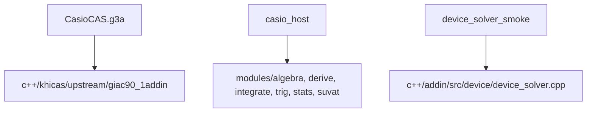

# Edexcel 9MA0 Scope

Sources:
- Pearson Edexcel A Level Mathematics 9MA0 specification, Issue 4, official PDF: https://qualifications.pearson.com/content/dam/pdf/A%20Level/Mathematics/2017/specification-and-sample-assesment/a-level-l3-mathematics-specification-issue4.pdf
- Pearson Edexcel A Level Further Mathematics 9FM0 specification, Issue 4, official PDF: https://qualifications.pearson.com/content/dam/pdf/A%20Level/Mathematics/2017/specification-and-sample-assesment/a-level-l3-further-mathematics-specification.pdf

Research refreshed: 2026-05-22.

9MA0 required:
- Pure: proof, algebra/functions, coordinate geometry, sequences/series, trig, exp/log, differentiation, integration, numerical methods, vectors.
- Stats: sampling, data presentation/interpretation, probability, distributions, hypothesis tests.
- Mechanics: units, kinematics, forces/Newton, moments.

9FM0-only:
- complex numbers, matrices, polar coordinates, hyperbolic functions, decision maths, Further Pure-only methods, Further Stats-only methods, Further Mechanics-only methods.
- Normal 9MA0 already includes normal distribution probabilities and normal-mean tests, so `normalcdf(...)` stays; `normald(...)` does not.
- Normal 9MA0 includes simple first-order differential equations, implicit/parametric differentiation, and 2D vectors; Further-only extensions do not stay just because they are nearby.

Current product decision:
- Target exam mode is normal A-level Maths.
- Further-only surfaces should be hidden or removed from the app working layer.
- 9MA0 parametric/implicit differentiation is first-derivative only; parametric second derivative, third derivative and fourth derivative routes are removed.
- User-requested removals stay out of the user-facing app catalogue/help: comb, normald, mean, median, stdev/stddev, correlation, covariance, linear_regression, plotting, rationalise, tabular, weierstrass, symmetry, mean_value, volumes/areas, parametric area/volumes, ztest, spark, hyperbolic functions.
- Boolean proof helper surfaces are also hidden; they are not 9MA0 mathematics.
- If a removed surface appears in a paper, record it as unsupported-ok unless the same mathematical part can be handled through a retained algebra/calculus route.
- Keep `normalcdf(mu,sigma,lo,hi)` because normal probabilities are 9MA0; remove `normald` catalogue/runtime surfaces.

## Current binary shape

`./compile` sets `CASIO_PRIZM_MODE=khicas-source` and builds the `.g3a` from the edited KhiCAS source tree under `c++/khicas/upstream/giac90_1addin`.
The rich host modules are testable with `c++/addin/host/build/casio_host`, but they are not the default `.g3a` working engine.
`device_solver.cpp` is a native prototype/smoke-test target, not the default shipped calculator engine.

## Current support inventory

| Surface | In `.g3a` source | Origin | Working lines |
|---|---|---|---|
| shell routing/menu | `main.cc`, `textGUI.cpp`, `catalogen.cpp` | CasioCAS wrapper over KhiCAS | yes for recognised student-solution calls |
| direct expressions/arithmetic | KhiCAS parser/evaluator | KhiCAS | no; compact result |
| `simplify`, `factor`, `expand`, `partfrac`, `complete_square`, `coeff`, `poly` | KhiCAS + wrapper aliases | both | partial/yes by recognised route |
| `solve`, `fsolve`, `solve_by`, hidden `solve_trig` aliases | KhiCAS + wrapper aliases | both | partial/yes by recognised route |
| `domain`, `range`, `compare`, `match`, `coeff_match`, `fitconst`, `xform`, `transform`, `rewrite`, `subst` | `main.cc` aliases + KhiCAS | both | partial/yes by recognised route |
| `diff`, `derive`, `normal_diff`, `implicit_diff`, `param_diff`, `tangent_line` | `main.cc` aliases + KhiCAS | both | yes for recognised 9MA0 routes |
| `integrate`, `int`, `defint`, `integrate_by`, `int_by`, `de_solve` | `main.cc` aliases + KhiCAS | both | yes for recognised 9MA0 routes |
| `trig_prove`, `trig_rewrite`, `trig_transform`, `trigcos`, `trigsin`, `trigtan` | `main.cc` aliases + KhiCAS | both | partial/yes by recognised route |
| `binomial` | active lexer/native + wrapper working | both | partial/yes |
| `binomial_cdf` | active lexer/native | KhiCAS | no wrapper working yet |
| `normalcdf` | `main.cc` alias to `normal_cdf` + active lexer entry | CasioCAS wrapper over KhiCAS | yes, compact standardisation |
| `suvat` | wrapper alias to KhiCAS solve | CasioCAS | yes for recognised forms |
| `gcd/lcm/factorial/isprime` | quick-menu/native utility | KhiCAS | no; obvious utility |
| core names `sin cos tan sec cosec/csc cot asin acos atan sqrt abs sign log ln log10 exp pi e inf` | parser/formatter support | KhiCAS | as part of routes |
| removed list: `comb normald mean median stdev correlation covariance linear_regression plot* disque rationalise tabular weierstrass symmetry mean_value volume* area_between param_area* param_volume* ztest spark hyperbolic` | runtime guard + catalogue/lexer policy | removed/blocked | no; compact unsupported |

Host/module-only routes that still need source-built `.g3a` parity:
- algebra: stronger inequalities, logs/exponentials, modulus, partial fractions, binomial series, domain/range, coefficient matching, parameter fitting.
- differentiation: robust chain/product/quotient/log/implicit/parametric/first-principles/second derivative working.
- integration/DE: robust substitution, parts, DI table, partial fractions, trig powers, definite integrals, separable/linear DEs.
- trig: robust proof/rewrite/transform/CAST/interval/R-form/multiple-angle equation routes.
- stats: stronger `binom`/`binomcdf` source-built parity and broader normal-tail variants.

Next rebuild decision:
- Treat `main.cc` wrapper working as the current shipped engine.
- Treat `device_solver.cpp` as a size-constrained prototype/fallback, not the final working engine.
- Port only 9MA0 route families from host/modules into the source-built `.g3a`, or replace current `.g3a` engine with a compact shared route planner.
- Remove answer-only utilities unless kept as obvious one-line helpers.
