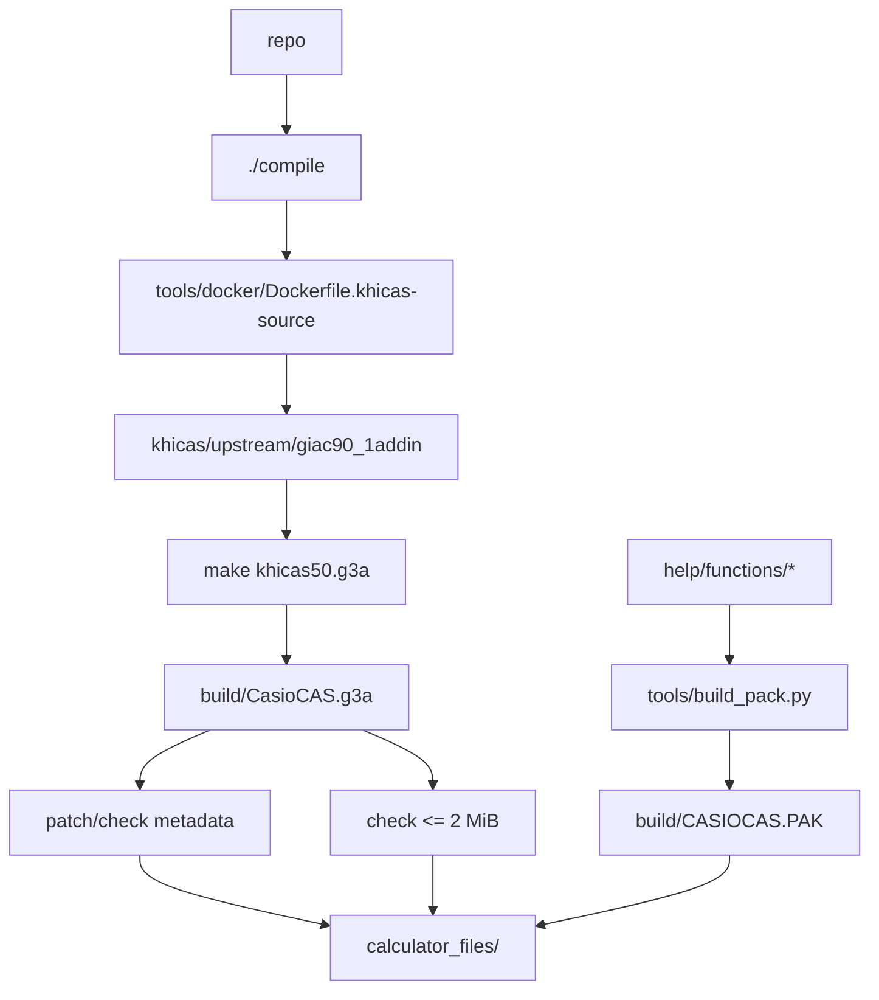
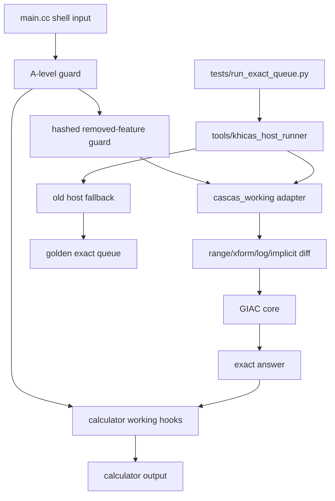
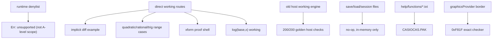
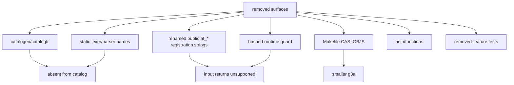
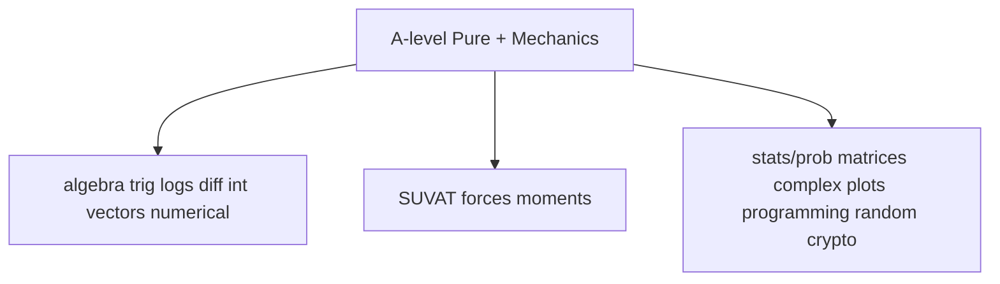
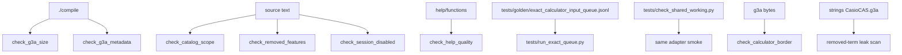
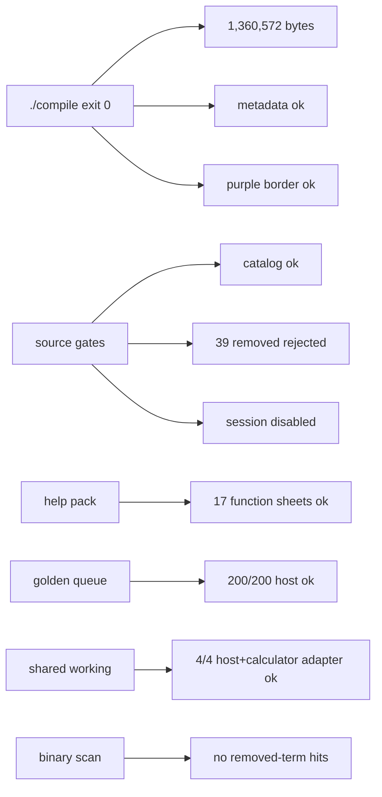

# CasioCAS Project Graph

Last updated: 2026-05-30 23:14 Europe/London

## Build

```mermaid
graph TD
  Root["repo"] --> Compile["./compile"]
  Compile --> Docker["tools/docker/Dockerfile.khicas-source"]
  Docker --> Src["khicas/upstream/giac90_1addin"]
  Src --> Make["make khicas50.g3a"]
  Make --> G3A["build/CasioCAS.g3a"]
  G3A --> Meta["patch/check metadata"]
  G3A --> Size["check <= 2 MiB"]
  Help["help/functions/*"] --> Pack["tools/build_pack.py"]
  Pack --> PAK["build/CASIOCAS.PAK"]
  Meta --> Transfer["calculator_files/"]
  Size --> Transfer
  PAK --> Transfer
```

## Source

```mermaid
graph TD
  Input["main.cc shell input"] --> Guard["A-level guard"]
  Guard --> Hash["hashed removed-feature guard"]
  Hash --> Shared["cascas_working adapter"]
  Shared --> Rewrite["range/xform/log/implicit diff"]
  Rewrite --> Giac["GIAC core"]
  Giac --> Answer["exact answer"]
  Guard --> CalcWork["calculator working hooks"]
  HostIn["tests/run_exact_queue.py"] --> HostWrap["tools/khicas_host_runner"]
  HostWrap --> Shared
  HostWrap --> HostWork["old host fallback"]
  Answer --> CalcWork
  CalcWork --> Console["calculator output"]
  HostWork --> Exact["golden exact queue"]
```

## Current V1

```mermaid
graph TD
  Guard["runtime denylist"] --> Unsupported["Err: unsupported (not A-level scope)"]
  Direct["direct working routes"] --> Implicit["implicit diff example"]
  Direct --> Range["quadratic/rational/trig range cases"]
  Direct --> Xform["xform proof shell"]
  Direct --> Log["log(base,x) working"]
  Host["old host working engine"] --> Queue["200/200 golden host checks"]
  Session["save/load/session files"] --> Disabled["no-op, in-memory only"]
  Help["help/functions/*.txt"] --> Pak["CASIOCAS.PAK"]
  Border["graphicsProvider border"] --> Pink["0xF81F exact checker"]
```

## Prune

```mermaid
graph TD
  Remove["removed surfaces"] --> Cat["catalogen/catalogfr"]
  Remove --> Lex["static lexer/parser names"]
  Remove --> Eval["renamed public at_* registration strings"]
  Remove --> Hash["hashed runtime guard"]
  Remove --> Obj["Makefile CAS_OBJS"]
  Remove --> Help["help/functions"]
  Remove --> Tests["removed-feature tests"]

  Cat --> Gate["absent from catalog"]
  Lex --> Gate
  Eval --> Gate2["input returns unsupported"]
  Hash --> Gate2
  Obj --> Size["smaller g3a"]
```

## Scope

```mermaid
graph TD
  Scope["A-level Pure + Mechanics"] --> Pure["algebra trig logs diff int vectors numerical"]
  Scope --> Mech["SUVAT forces moments"]
  Scope --> Out["stats/prob matrices complex plots programming random crypto"]
```

## Tests

```mermaid
graph TD
  Build["./compile"] --> Size["check_g3a_size"]
  Build --> Meta["check_g3a_metadata"]
  Source["source text"] --> Catalog["check_catalog_scope"]
  Source --> Removed["check_removed_features"]
  Source --> Session["check_session_disabled"]
  Help["help/functions"] --> HelpQ["check_help_quality"]
  Queue["tests/golden/exact_calculator_input_queue.jsonl"] --> Exact["tests/run_exact_queue.py"]
  Shared["tests/check_shared_working.py"] --> SharedGate["same adapter smoke"]
  UI["g3a bytes"] --> Border["check_calculator_border"]
  Bin["strings CasioCAS.g3a"] --> Leak["removed-term leak scan"]
```

## Latest Gates

```mermaid
graph LR
  Build["./compile exit 0"] --> Size["1,360,572 bytes"]
  Build --> Meta["metadata ok"]
  Build --> Border["purple border ok"]
  Source["source gates"] --> Catalog["catalog ok"]
  Source --> Removed["39 removed rejected"]
  Source --> Session["session disabled"]
  Help["help pack"] --> HelpQ["17 function sheets ok"]
  Queue["golden queue"] --> QueueRun["200/200 host ok"]
  Shared["shared working"] --> SharedRun["4/4 host+calculator adapter ok"]
  Bin["binary scan"] --> NoLeak["no removed-term hits"]
```
