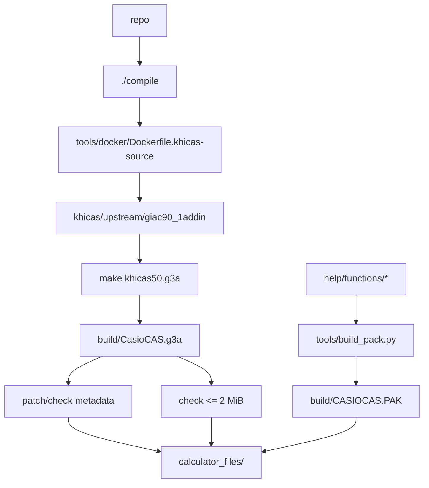
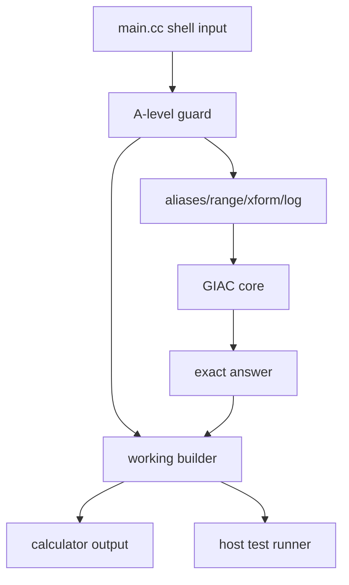
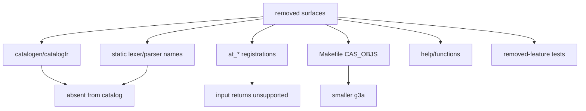
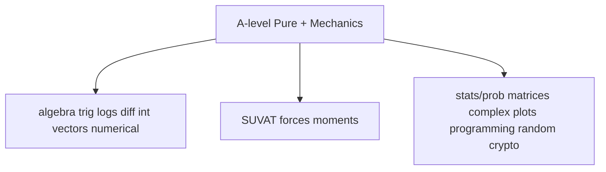
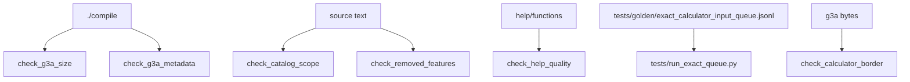

# CasioCAS Project Graph

## Build

```mermaid
graph TD
  Root["repo"] --> Compile["./compile"]
  Compile --> Docker["tools/docker/Dockerfile.khicas-source"]
  Docker --> Src["khicas/upstream/giac90_1addin"]
  Src --> Make["make khicas50.g3a"]
  Make --> G3A["build/CasioCAS.g3a"]
  G3A --> Meta["patch/check metadata"]
  G3A --> Size["check <= 2 MiB"]
  Help["help/functions/*"] --> Pack["tools/build_pack.py"]
  Pack --> PAK["build/CASIOCAS.PAK"]
  Meta --> Transfer["calculator_files/"]
  Size --> Transfer
  PAK --> Transfer
```

## Source

```mermaid
graph TD
  Input["main.cc shell input"] --> Guard["A-level guard"]
  Guard --> Rewrite["aliases/range/xform/log"]
  Rewrite --> Giac["GIAC core"]
  Giac --> Answer["exact answer"]
  Guard --> Work["working builder"]
  Answer --> Work
  Work --> Console["calculator output"]
  Work --> Host["host test runner"]
```

## Prune

```mermaid
graph TD
  Remove["removed surfaces"] --> Cat["catalogen/catalogfr"]
  Remove --> Lex["static lexer/parser names"]
  Remove --> Eval["at_* registrations"]
  Remove --> Obj["Makefile CAS_OBJS"]
  Remove --> Help["help/functions"]
  Remove --> Tests["removed-feature tests"]

  Cat --> Gate["absent from catalog"]
  Lex --> Gate
  Eval --> Gate2["input returns unsupported"]
  Obj --> Size["smaller g3a"]
```

## Scope

```mermaid
graph TD
  Scope["A-level Pure + Mechanics"] --> Pure["algebra trig logs diff int vectors numerical"]
  Scope --> Mech["SUVAT forces moments"]
  Scope --> Out["stats/prob matrices complex plots programming random crypto"]
```

## Tests

```mermaid
graph TD
  Build["./compile"] --> Size["check_g3a_size"]
  Build --> Meta["check_g3a_metadata"]
  Source["source text"] --> Catalog["check_catalog_scope"]
  Source --> Removed["check_removed_features"]
  Help["help/functions"] --> HelpQ["check_help_quality"]
  Queue["tests/golden/exact_calculator_input_queue.jsonl"] --> Exact["tests/run_exact_queue.py"]
  UI["g3a bytes"] --> Border["check_calculator_border"]
```
