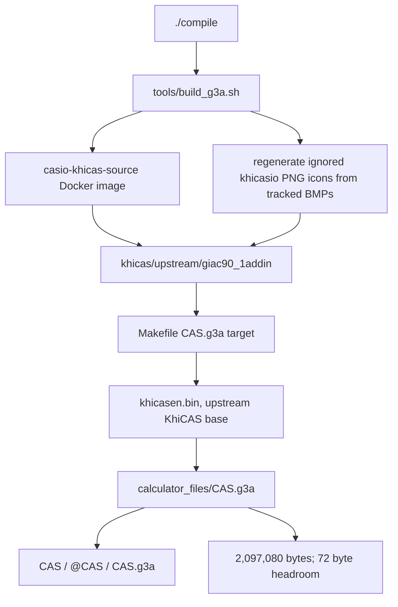
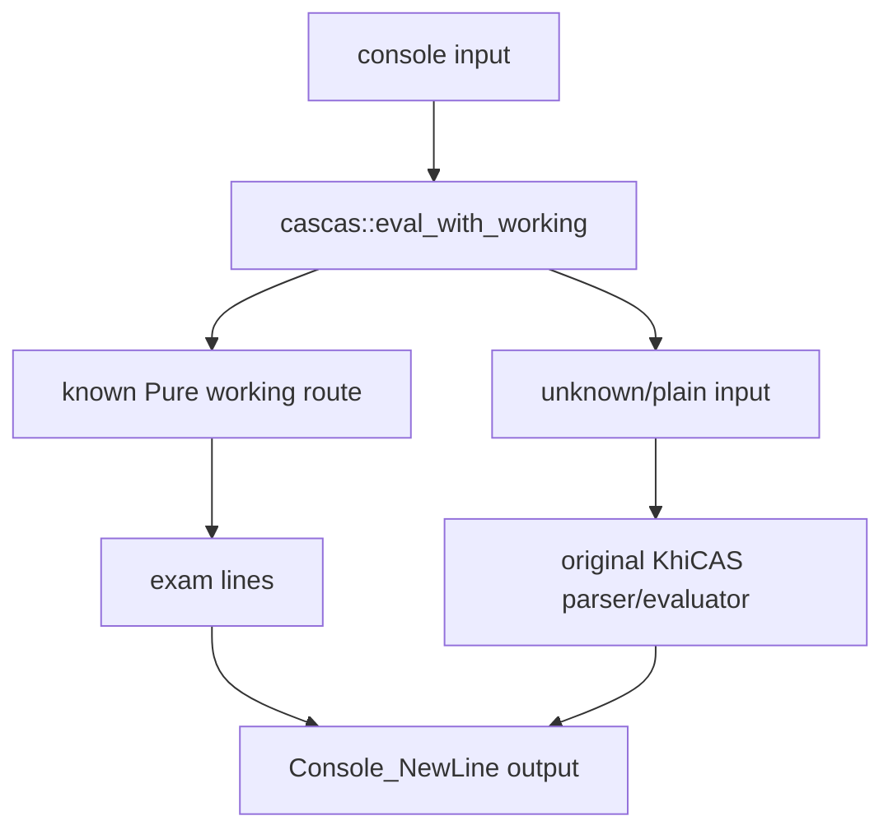
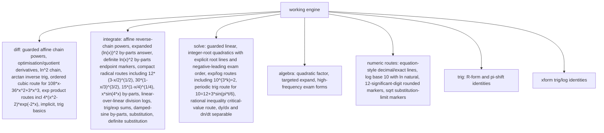
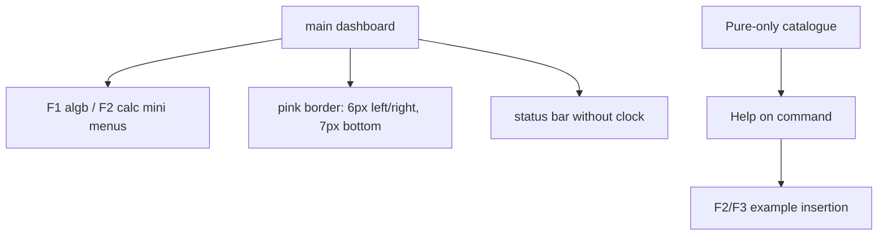
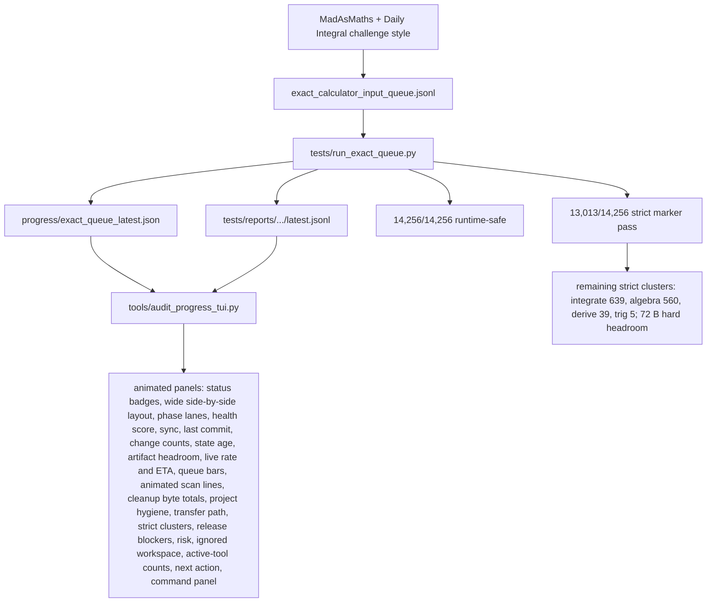
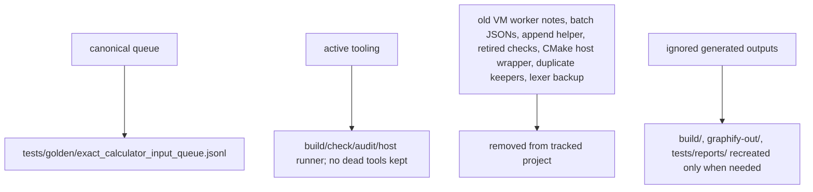

# Project Graph

Last updated: 2026-06-01 06:02 BST

## Build

```mermaid
graph TD
  Compile["./compile"] --> Build["tools/build_g3a.sh"]
  Build --> Docker["casio-khicas-source Docker image"]
  Docker --> Src["khicas/upstream/giac90_1addin"]
  Build --> Icons["regenerate ignored khicasio PNG icons from tracked BMPs"]
  Icons --> Src
  Src --> Make["Makefile CAS.g3a target"]
  Make --> Bin["khicasen.bin, upstream KhiCAS base"]
  Bin --> G3A["calculator_files/CAS.g3a"]
  G3A --> Meta["CAS / @CAS / CAS.g3a"]
  G3A --> Size["2,097,080 bytes; 72 byte headroom"]
```

## Runtime

```mermaid
graph TD
  Input["console input"] --> Guard["cascas::eval_with_working"]
  Guard --> Work["known Pure working route"]
  Work --> Steps["exam lines"]
  Steps --> Console["Console_NewLine output"]
  Guard --> Fallback["unknown/plain input"]
  Fallback --> KhiCAS["original KhiCAS parser/evaluator"]
  KhiCAS --> Console
```

## Working Routes

```mermaid
graph TD
  Work["working engine"] --> Diff["diff: guarded affine chain powers, optimisation/quotient derivatives, ln^2 chain, arctan inverse trig, ordered cubic route for 108*x-36*x^2+3*x^3, exp product routes incl 4*(x^2-2)*exp(-2*x), implicit, trig basics"]
  Work --> Int["integrate: affine reverse-chain powers, expanded (ln(x))^2 by-parts answer, definite ln(x)^2 by-parts endpoint markers, compact radical routes including 12*(3-x/2)^(1/2), 30*(1-x/3)^(3/2), 15*(1-x/4)^(1/4), x*sin(4*x) by-parts, linear-over-linear division logs, trig/exp sums, damped-sine by-parts, substitution, definite substitution"]
  Work --> Solve["solve: guarded linear, integer-root quadratics with explicit root lines and negative-leading exam order, exp/log routes including 10^(3*k)=2, periodic trig route for 10=12+3*sin(pi*t/6), rational inequality critical-value route, dy/dx and dn/dt separable"]
  Work --> Alg["algebra: quadratic factor, targeted expand, high-frequency exam forms"]
  Work --> Num["numeric routes: equation-style decimal/exact lines, log base 10 with ln natural, 12-significant-digit rounded markers, sqrt substitution-limit markers"]
  Work --> Trig["trig: R-form and pi-shift identities"]
  Work --> Xform["xform trig/log identities"]
```

## UI

```mermaid
graph TD
  Console["main dashboard"] --> FMenu["F1 algb / F2 calc mini menus"]
  Console --> Border["pink border: 6px left/right, 7px bottom"]
  Console --> Status["status bar without clock"]
  Catalog["Pure-only catalogue"] --> Help["Help on command"]
  Help --> Examples["F2/F3 example insertion"]
```

## Queue Status

```mermaid
graph TD
  Online["MadAsMaths + Daily Integral challenge style"] --> Queue["exact_calculator_input_queue.jsonl"]
  Queue --> Runner["tests/run_exact_queue.py"]
  Runner --> Live["progress/exact_queue_latest.json"]
  Runner --> Report["tests/reports/.../latest.jsonl"]
  Live --> TUI["tools/audit_progress_tui.py"]
  Report --> TUI
  TUI --> Panels["animated panels: status badges, wide side-by-side layout, phase lanes, health score, sync, last commit, change counts, state age, artifact headroom, live rate and ETA, queue bars, animated scan lines, cleanup byte totals, project hygiene, transfer path, strict clusters, release blockers, risk, ignored workspace, active-tool counts, next action, command panel"]
  Runner --> Runtime["14,256/14,256 runtime-safe"]
  Runner --> Strict["13,013/14,256 strict marker pass"]
  Strict --> Remaining["remaining strict clusters: integrate 639, algebra 560, derive 39, trig 5; 72 B hard headroom"]
```

## Project Shape

```mermaid
graph TD
  Canon["canonical queue"] --> Golden["tests/golden/exact_calculator_input_queue.jsonl"]
  Tooling["active tooling"] --> Build["build/check/audit/host runner; no dead tools kept"]
  Old["old VM worker notes, batch JSONs, append helper, retired checks, CMake host wrapper, duplicate keepers, lexer backup"] --> Pruned["removed from tracked project"]
  Reports["ignored generated outputs"] --> Recreate["build/, graphify-out/, tests/reports/ recreated only when needed"]
```
