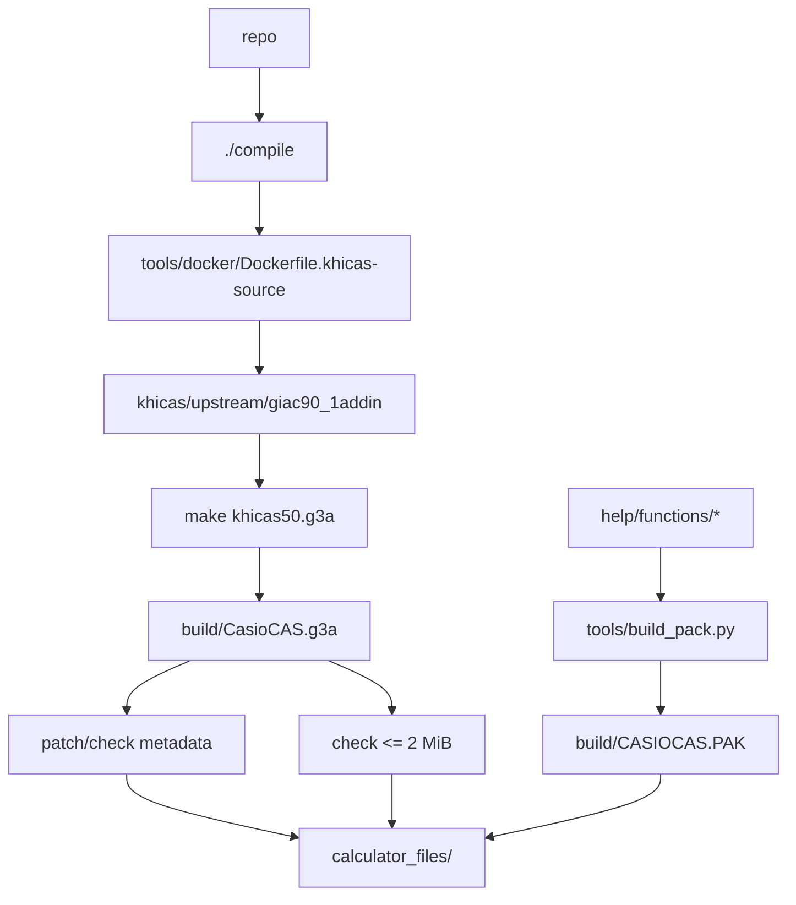
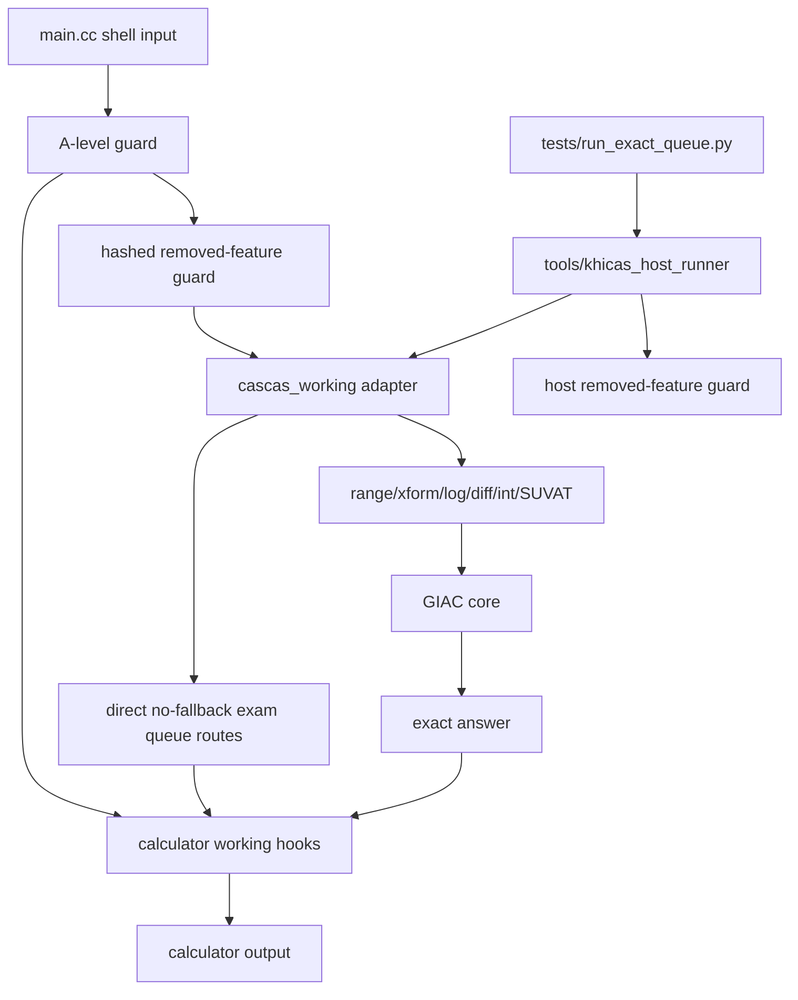
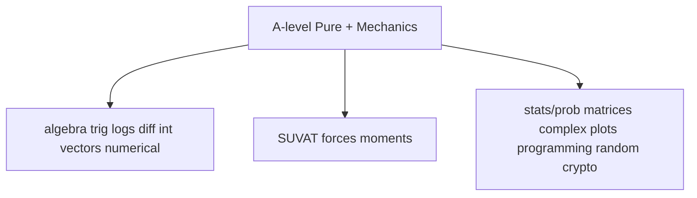
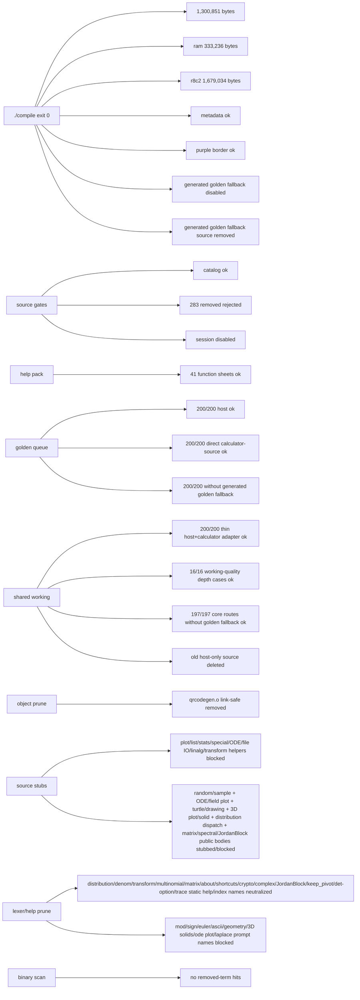

# CasioCAS Project Graph

Last updated: 2026-05-31 07:08 Europe/London

## Build

```mermaid
graph TD
  Root["repo"] --> Compile["./compile"]
  Compile --> Docker["tools/docker/Dockerfile.khicas-source"]
  Docker --> Src["khicas/upstream/giac90_1addin"]
  Src --> Make["make khicas50.g3a"]
  Make --> G3A["build/CasioCAS.g3a"]
  G3A --> Meta["patch/check metadata"]
  G3A --> Size["check <= 2 MiB"]
  Help["help/functions/*"] --> Pack["tools/build_pack.py"]
  Pack --> PAK["build/CASIOCAS.PAK"]
  Meta --> Transfer["calculator_files/"]
  Size --> Transfer
  PAK --> Transfer
```

## Source

```mermaid
graph TD
  Input["main.cc shell input"] --> Guard["A-level guard"]
  Guard --> Hash["hashed removed-feature guard"]
  Hash --> Shared["cascas_working adapter"]
  Shared --> Rewrite["range/xform/log/diff/int/SUVAT"]
  Shared --> DirectQueue["direct no-fallback exam queue routes"]
  Rewrite --> Giac["GIAC core"]
  DirectQueue --> CalcWork
  Giac --> Answer["exact answer"]
  Guard --> CalcWork["calculator working hooks"]
  HostIn["tests/run_exact_queue.py"] --> HostWrap["tools/khicas_host_runner"]
  HostWrap --> HostGuard["host removed-feature guard"]
  HostWrap --> Shared
  Answer --> CalcWork
  CalcWork --> Console["calculator output"]
```

## Current V1

```mermaid
graph TD
  Guard["runtime denylist"] --> Unsupported["Err: unsupported (not A-level scope)"]
  Direct["direct working routes"] --> Implicit["implicit diff example"]
  Direct --> Range["quadratic/rational/abs/sqrt/trig range cases"]
  Direct --> DiffInt["power/product/chain/quotient diff + trig/log integrals"]
  Direct --> Xform["identity/log/sec/cosec/cot/half-angle proof shell"]
  Direct --> Log["log(base,x) working"]
  Direct --> Suvat["SUVAT displacement working"]
  Direct --> MoreWork["tan/sec/cosec diff, golden solve routes, reciprocal ranges"]
  Direct --> FilteredSolve["quadratic roots with integer/positive/reject filters"]
  Direct --> Numeric["numeric estimates, rounding, time conversion, root brackets"]
  Direct --> ExamSolve["log/inequality/trig/circle exact solve routes"]
  Direct --> GeoSolve["circle/tangent/region algebra solve routes"]
  Direct --> Periodic["periodic trig and sequence solve routes"]
  Direct --> BinomSeries["4-arg binomial series route"]
  Direct --> Affine["generic exact affine solve route"]
  Direct --> Arith["generic exact rational arithmetic route"]
  Direct --> NumericEval["generic numeric evaluator for method=numeric"]
  Direct --> Poly["generic rational polynomial expand/factor/quadratic solve"]
  Direct --> EvalAt["generic complete_square/evalat polynomial routes"]
  Direct --> PolyCalc["explicit polynomial diff/int routes"]
  Direct --> Targeted["symbolic linear rearrange + 2^linear solve routes"]
  Direct --> RationalSurd["targeted rational/surd differentiation solve routes"]
  Direct --> ExamExact["direct exam queue routes: sequences, geometry, trig identity, partial fractions, binomial, exponential models"]
  Direct --> Quality["16-case working-quality depth gate across calculus, range, solve, xform, binomial, partfrac, SUVAT"]
  Suvat --> KeySuvat["key-value u/t roots"]
  Host["thin same-source host wrapper"] --> Queue["200/200 exact queue host checks"]
  Host --> DeletedHost["old host-only working_engine/src deleted"]
  QueueTests["exact queue file"] --> SameSource["200/200 direct no-fallback calculator-source coverage"]
  RemovedFallback["generated golden fallback source removed"] --> SameSource
  Session["save/load/session files"] --> Disabled["no-op, in-memory only"]
  Help["help/functions/*.txt"] --> Pak["CASIOCAS.PAK"]
  Border["graphicsProvider border"] --> Pink["0xF81F exact checker"]
```

## Prune

```mermaid
graph TD
  Remove["removed surfaces"] --> Cat["catalogen/catalogfr"]
  Remove --> Lex["static lexer/parser names"]
  Remove --> Eval["renamed public at_* registration strings"]
  Remove --> Hash["hashed runtime guard"]
  Remove --> Obj["Makefile CAS_OBJS"]
  Remove --> Macro["CASCAS_ALEVEL_ONLY"]
  Remove --> Sec["-ffunction-sections -fdata-sections"]
  Obj --> QR["qrcodegen.o removed"]
  Macro --> Stubs["plot/permutation/list/stats/special source stubs"]
  Macro --> RuntimeStubs["random/sample, ODE/field plot, turtle/drawing bodies stubbed"]
  Macro --> TurtleStubs["TURTLETAB table capped to one entry in A-level build"]
  Macro --> Plot3DStubs["3D solids/plot runtime stubbed in zplot3d"]
  Macro --> DistDispatch["generic cdf/icdf/mgf/distribution dispatch stubbed"]
  Macro --> RandDist["randvector distribution sampling compiled out"]
  Macro --> MatrixSpectral["matrix/spectral wrappers and Jordan-only internals stubbed/compile-excluded: det/rank/rref/kernel/eigen/svd/jordan/JordanBlock/ranm/trace/transpose/cholesky"]
  Macro --> More["desolve/fft/file IO/charpoly/pcar/pivot/keep_pivot/det options/assume blocked"]
  Macro --> XformPrune["halftan/exp2trig/trig2exp/evalc/q2a/a2q blocked"]
  Remove --> Menu["console catalog/menu/message leaks"]
  Remove --> PyImport["python/numpy/pylab/matplotlib/turtle literals hidden"]
  Lex --> Static["static lexer distro aliases neutralized"]
  Lex --> MultiHide["multinomial lexer strings hidden"]
  Lex --> Hide["concat/extend lexer strings hidden"]
  Macro --> Dist["normal/poisson/uniform/exponential/student/fisher/chi-square/etc public stats blocked"]
  Macro --> BinomGuard["2-arg binomial coefficient blocked; 4-arg series allowed"]
  Cat --> StatsCat["stats catalog entries removed"]
  Remove --> Help["help/functions"]
  Remove --> Tests["removed-feature tests"]

  Cat --> Gate["absent from catalog"]
  Lex --> Gate
  Eval --> Gate2["input returns unsupported"]
  Hash --> Gate2
  Stubs --> Gate2
  RuntimeStubs --> Gate2
  TurtleStubs --> Gate2
  Plot3DStubs --> Gate2
  DistDispatch --> Gate2
  RandDist --> Gate2
  MatrixSpectral --> Gate2
  More --> Gate2
  XformPrune --> Gate2
  Menu --> Gate
  PyImport --> Gate
  Dist --> Gate2
  BinomGuard --> Gate2
  Hide --> Gate
  Static --> Gate
  MultiHide --> Gate
  StatsCat --> Gate
  Obj --> Size["smaller g3a"]
  QR --> Size
  Sec --> Size
```

## Scope

```mermaid
graph TD
  Scope["A-level Pure + Mechanics"] --> Pure["algebra trig logs diff int vectors numerical"]
  Scope --> Mech["SUVAT forces moments"]
  Scope --> Out["stats/prob matrices complex plots programming random crypto"]
```

## Tests

```mermaid
graph TD
  Build["./compile"] --> Size["check_g3a_size"]
  Build --> Meta["check_g3a_metadata"]
  Source["source text"] --> Catalog["check_catalog_scope"]
  Source --> Removed["check_removed_features"]
  Source --> Session["check_session_disabled"]
  Help["help/functions"] --> HelpQ["check_help_quality"]
  Queue["tests/golden/exact_calculator_input_queue.jsonl"] --> Exact["tests/run_exact_queue.py"]
  Shared["tests/check_shared_working.py"] --> SharedGate["same adapter smoke"]
  Shared --> WorkingQuality["tests/check_working_quality.py"]
  Shared --> CoreNoGolden["tests/check_shared_core_without_golden.py"]
  Queue --> GoldenCoverage["tests/check_golden_shared_coverage.py"]
  Queue --> NoGoldenAudit["tests/audit_no_golden_queue_coverage.py"]
  UI["g3a bytes"] --> Border["check_calculator_border"]
  Bin["strings CasioCAS.g3a"] --> Leak["removed-term leak scan"]
```

## Latest Gates

```mermaid
graph LR
  Build["./compile exit 0"] --> Size["1,300,851 bytes"]
  Build --> Ram["ram 333,236 bytes"]
  Build --> R8C2["r8c2 1,679,034 bytes"]
  Build --> Meta["metadata ok"]
  Build --> Border["purple border ok"]
  Build --> NoRuntimeFallback["generated golden fallback disabled"]
  Build --> NoRuntimeSource["generated golden fallback source removed"]
  Source["source gates"] --> Catalog["catalog ok"]
  Source --> Removed["283 removed rejected"]
  Source --> Session["session disabled"]
  Help["help pack"] --> HelpQ["41 function sheets ok"]
  Queue["golden queue"] --> QueueRun["200/200 host ok"]
  Queue --> GoldenRun["200/200 direct calculator-source ok"]
  Queue --> NoGolden["200/200 without generated golden fallback"]
  Shared["shared working"] --> SharedRun["200/200 thin host+calculator adapter ok"]
  Shared --> WorkQ["16/16 working-quality depth cases ok"]
  Shared --> CoreRun["197/197 core routes without golden fallback ok"]
  Shared --> NoHostSrc["old host-only source deleted"]
  Obj["object prune"] --> QR["qrcodegen.o link-safe removed"]
  Macro["source stubs"] --> Stubbed["plot/list/stats/special/ODE/file IO/linalg/transform helpers blocked"]
  Macro --> RuntimeStubbed["random/sample + ODE/field plot + turtle/drawing + 3D plot/solid + distribution dispatch + matrix/spectral/JordanBlock public bodies stubbed/blocked"]
  Static["lexer/help prune"] --> StaticRun["distribution/denom/transform/multinomial/matrix/about/shortcuts/crypto/complex/JordanBlock/keep_pivot/det-option/trace static help/index names neutralized"]
  Static --> PromptRun["mod/sign/euler/ascii/geometry/3D solids/ode plot/laplace prompt names blocked"]
  Bin["binary scan"] --> NoLeak["no removed-term hits"]
```
