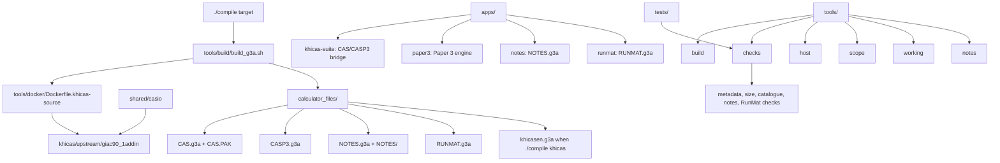

# Project Graph

Last updated: 2026-06-17.

```mermaid
graph TD
  Compile["./compile target"] --> Build["tools/build/build_g3a.sh"]
  Build --> Docker["tools/docker/Dockerfile.khicas-source"]
  Docker --> Upstream["khicas/upstream/giac90_1addin"]

  Apps["apps/"] --> Suite["khicas-suite: CAS/CASP3 bridge"]
  Apps --> Paper3["paper3: Paper 3 engine"]
  Apps --> Notes["notes: NOTES.g3a"]
  Apps --> RunMat["runmat: RUNMAT.g3a"]
  Shared["shared/casio"] --> Upstream

  Build --> Calc["calculator_files/"]
  Calc --> CAS["CAS.g3a + CAS.PAK"]
  Calc --> CASP3["CASP3.g3a"]
  Calc --> NOTES["NOTES.g3a + NOTES/"]
  Calc --> RUNMAT["RUNMAT.g3a"]
  Calc --> KHICAS["khicasen.g3a when ./compile khicas"]

  Tools["tools/"] --> BuildTools["build"]
  Tools --> Checks["checks"]
  Tools --> Host["host"]
  Tools --> Scope["scope"]
  Tools --> Working["working"]
  Tools --> NotesTools["notes"]

  Tests["tests/"] --> Checks
  Checks --> Artifacts["metadata, size, catalogue, notes, RunMat checks"]
```
