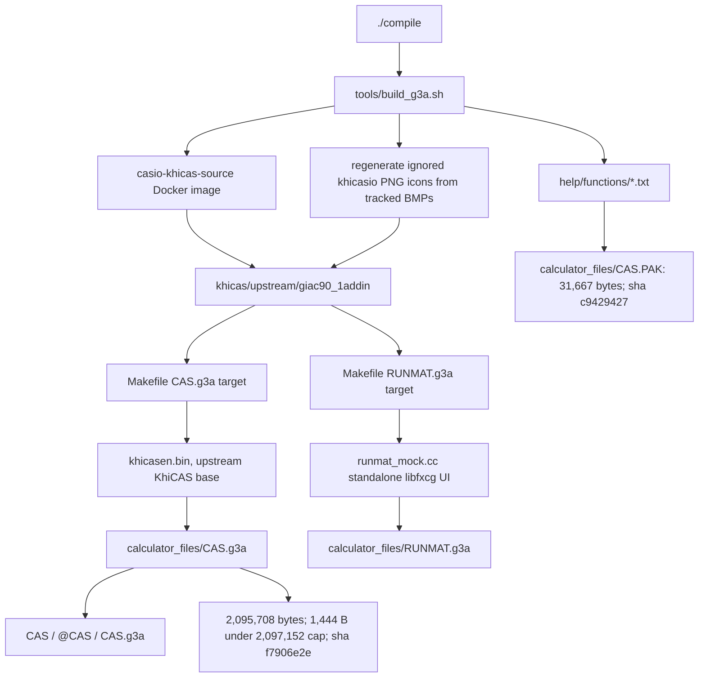
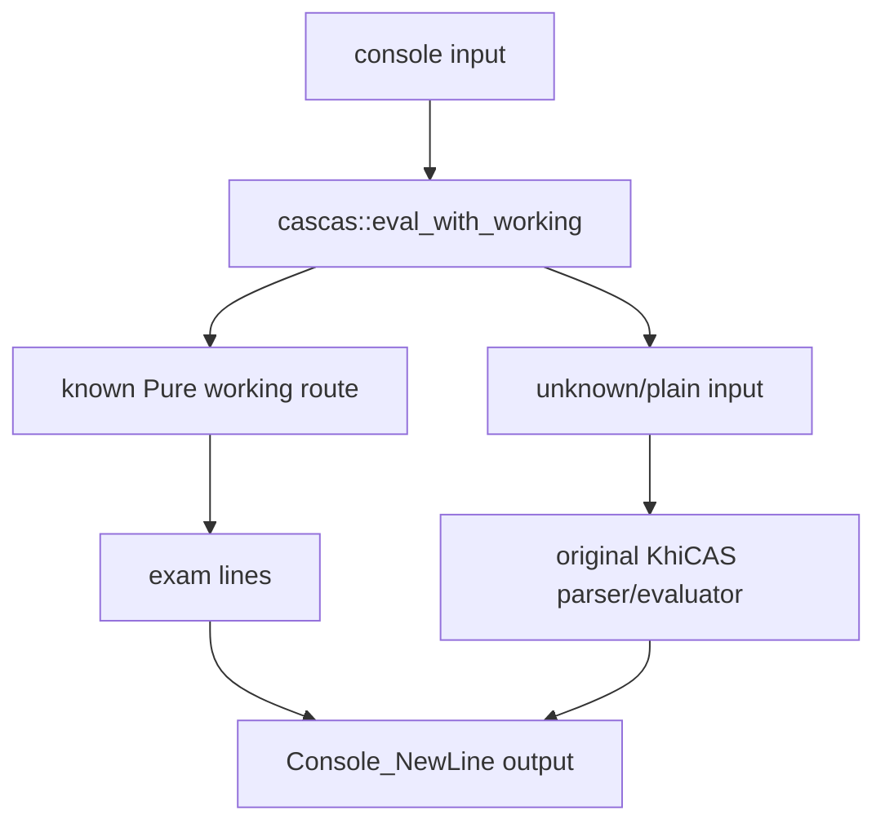
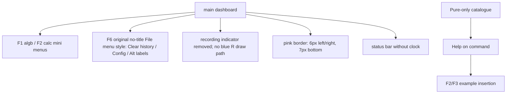
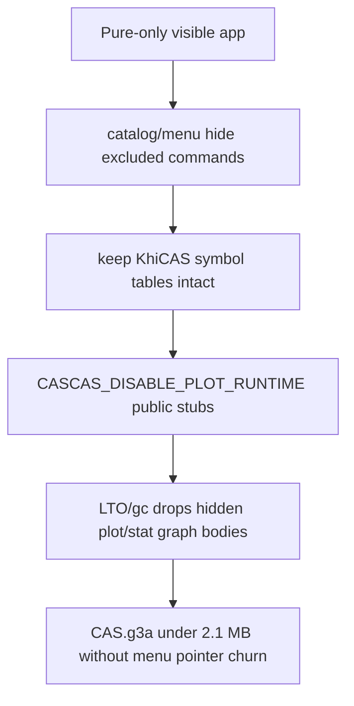
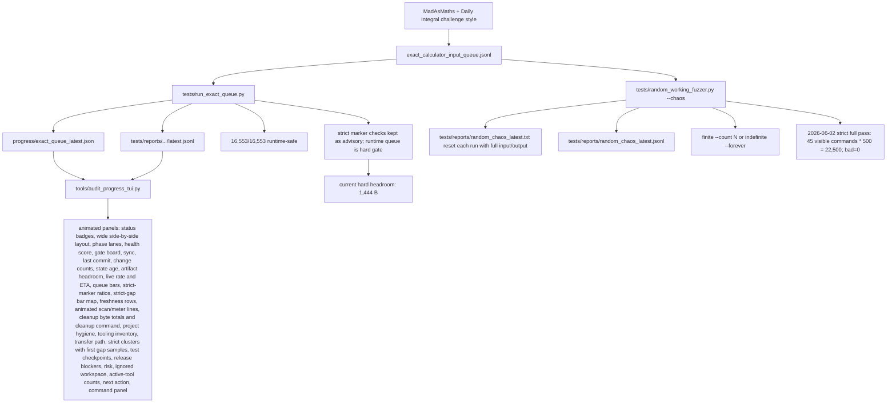
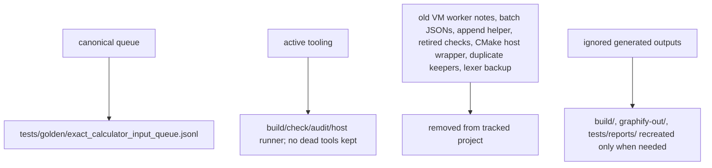

# Project Graph

Last updated: 2026-06-02 12:09 BST

## Build

```mermaid
graph TD
  Compile["./compile"] --> Build["tools/build_g3a.sh"]
  Build --> Docker["casio-khicas-source Docker image"]
  Docker --> Src["khicas/upstream/giac90_1addin"]
  Build --> Icons["regenerate ignored khicasio PNG icons from tracked BMPs"]
  Icons --> Src
  Src --> Make["Makefile CAS.g3a target"]
  Make --> Bin["khicasen.bin, upstream KhiCAS base"]
  Bin --> G3A["calculator_files/CAS.g3a"]
  Src --> RunMatMake["Makefile RUNMAT.g3a target"]
  RunMatMake --> RunMatSrc["runmat_mock.cc standalone libfxcg UI"]
  RunMatSrc --> RunMatG3A["calculator_files/RUNMAT.g3a"]
  Build --> Help["help/functions/*.txt"]
  Help --> PAK["calculator_files/CAS.PAK: 31,667 bytes; sha c9429427"]
  G3A --> Meta["CAS / @CAS / CAS.g3a"]
  G3A --> Size["2,095,708 bytes; 1,444 B under 2,097,152 cap; sha f7906e2e"]
```

## Runtime

```mermaid
graph TD
  Input["console input"] --> Guard["cascas::eval_with_working"]
  Guard --> Work["known Pure working route"]
  Work --> Steps["exam lines"]
  Steps --> Console["Console_NewLine output"]
  Guard --> Fallback["unknown/plain input"]
  Fallback --> KhiCAS["original KhiCAS parser/evaluator"]
  KhiCAS --> Console
```

## Working Routes

```mermaid
graph TD
  Work["working engine"] --> Diff["diff: guarded affine chain powers, optimisation/quotient derivatives, ln^2 chain, arctan inverse trig, ordered cubic route for 108*x-36*x^2+3*x^3, exp product routes incl 4*(x^2-2)*exp(-2*x), implicit, trig basics"]
  Work --> Int["integrate: affine reverse-chain powers with reciprocal exam form for negative powers, polynomial-over-x^n rewrite, trig identity products/squares/sec-cot forms, full-derivative quadratic substitution like (2*x+1)*cos(x^2+x), reciprocal affine logs c/(a*x+b), sums of reciprocal affine terms, expanded (ln(x))^2 by-parts answer, definite ln(x)^2 by-parts endpoint markers, compact radical routes including 12*(3-x/2)^(1/2), 30*(1-x/3)^(3/2), 15*(1-x/4)^(1/4), 3*x^2*(4-2*x^3)^(3/2), (x+1)/(x^2+2*x+3)^(1/3), affine trig/exp terms like sin(4*x+3), cos(2-3*x), exp(1-3*x), generic c*x*sin/cos(a*x+b) by-parts, x^2*cos(x/3) by-parts, and 1/(sqrt(x)(sqrt(x)+2)) definite substitution, linear-over-linear division logs, damped-sine by-parts, substitution, definite substitution"]
  Work --> Solve["solve: shared affine parser, surd-linear equations, reciprocal-linear equations, guarded linear with exam-order lines for 8000=64000-15*k and 64000-11200*t=0, integer/rational-root quadratics through one shared formatter, product-coefficient preservation, common-factor exam order, exp/log routes including 10^(3*k)=2, rational route for k*(k+3)/(k+1)=2, circle-intersection route, periodic trig route for 10=12+3*sin(pi*t/6), rational inequality critical-value route, dy/dx and dn/dt separable"]
  Work --> Alg["algebra: variable-aware quadratic factor, simplify rational cancel-after-factor, targeted expand, high-frequency exam forms, binomial series coefficient/term lines for three queue patterns"]
  Work --> PF["partial fractions: targeted apart marker route for 6/(u*(3+2*u))"]
  Work --> Vec["vectors: targeted subtraction marker for [3,-3,-4]-[2,5,-6], scalar marker for 2*[1,-8,2]"]
  Work --> Num["numeric routes: equation-style decimal/exact lines, circle perimeter exact-before-decimal route, exp(2*ln(7/6)) marker, log base 10 with ln natural, 12-significant-digit rounded markers, sqrt substitution-limit markers"]
  Work --> Trig["trig: R-form and pi-shift identities"]
  Work --> Xform["xform trig/log identities, inverse exp-ln/ln-exp/sqrt-square rewrites, factor-cancel routes"]
  Work --> Shared["shared helpers: top-level parser guards, parenthesis-aware fraction split, affine parser, quadratic formatter, surd arithmetic"]
  Work --> Guards["finite numeric guards: invalid-domain numeric routes keep symbolic output, not nan"]
  Work --> Empty["empty function calls preserve input safely: simplify(), diff(), log()"]
  Work --> FuzzGuards["random-fuzz guards: one-arg log route, oversized working input surface, no raw echo for working commands, no host abort on deep diff"]
```

## UI

```mermaid
graph TD
  Console["main dashboard"] --> FMenu["F1 algb / F2 calc mini menus"]
  Console --> F6["F6 original no-title File menu style: Clear history / Config / Alt labels"]
  Console --> Rec["recording indicator removed; no blue R draw path"]
  Console --> Border["pink border: 6px left/right, 7px bottom"]
  Console --> Status["status bar without clock"]
  Catalog["Pure-only catalogue"] --> Help["Help on command"]
  Help --> Examples["F2/F3 example insertion"]
```

## Hidden Runtime Trim

```mermaid
graph TD
  Scope["Pure-only visible app"] --> Hide["catalog/menu hide excluded commands"]
  Hide --> KeepSymbols["keep KhiCAS symbol tables intact"]
  KeepSymbols --> Stub["CASCAS_DISABLE_PLOT_RUNTIME public stubs"]
  Stub --> Drop["LTO/gc drops hidden plot/stat graph bodies"]
  Drop --> Size["CAS.g3a under 2.1 MB without menu pointer churn"]
```

## Queue Status

```mermaid
graph TD
  Online["MadAsMaths + Daily Integral challenge style"] --> Queue["exact_calculator_input_queue.jsonl"]
  Queue --> Runner["tests/run_exact_queue.py"]
  Runner --> Live["progress/exact_queue_latest.json"]
  Runner --> Report["tests/reports/.../latest.jsonl"]
  Live --> TUI["tools/audit_progress_tui.py"]
  Report --> TUI
  Queue --> Chaos["tests/random_working_fuzzer.py --chaos"]
  Chaos --> Transcript["tests/reports/random_chaos_latest.txt reset each run with full input/output"]
  Chaos --> FuzzReport["tests/reports/random_chaos_latest.jsonl"]
  Chaos --> Modes["finite --count N or indefinite --forever"]
  Chaos --> FinalStrict["2026-06-02 strict full pass: 45 visible commands * 500 = 22,500; bad=0"]
  TUI --> Panels["animated panels: status badges, wide side-by-side layout, phase lanes, health score, gate board, sync, last commit, change counts, state age, artifact headroom, live rate and ETA, queue bars, strict-marker ratios, strict-gap bar map, freshness rows, animated scan/meter lines, cleanup byte totals and cleanup command, project hygiene, tooling inventory, transfer path, strict clusters with first gap samples, test checkpoints, release blockers, risk, ignored workspace, active-tool counts, next action, command panel"]
  Runner --> Runtime["16,553/16,553 runtime-safe"]
  Runner --> Strict["strict marker checks kept as advisory; runtime queue is hard gate"]
  Strict --> Remaining["current hard headroom: 1,444 B"]
```

## Project Shape

```mermaid
graph TD
  Canon["canonical queue"] --> Golden["tests/golden/exact_calculator_input_queue.jsonl"]
  Tooling["active tooling"] --> Build["build/check/audit/host runner; no dead tools kept"]
  Old["old VM worker notes, batch JSONs, append helper, retired checks, CMake host wrapper, duplicate keepers, lexer backup"] --> Pruned["removed from tracked project"]
  Reports["ignored generated outputs"] --> Recreate["build/, graphify-out/, tests/reports/ recreated only when needed"]
```
