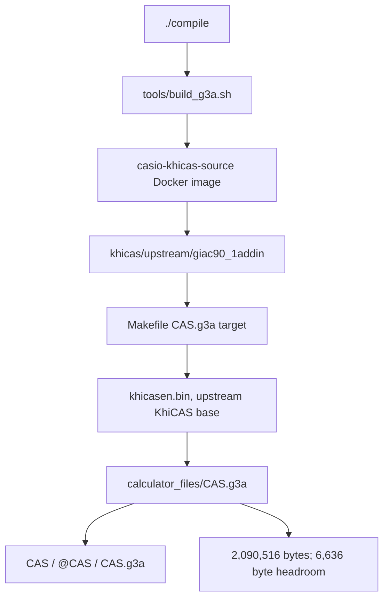
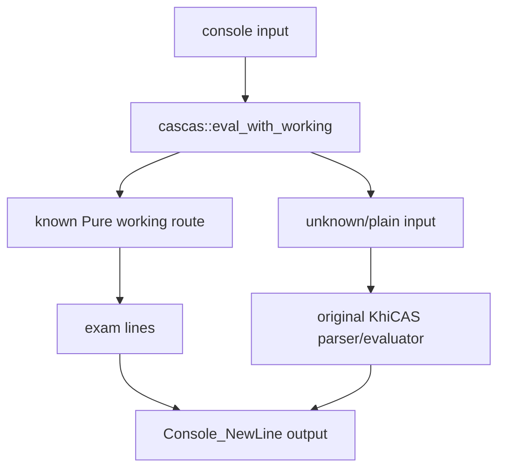
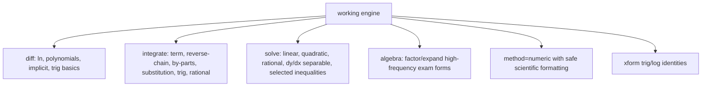
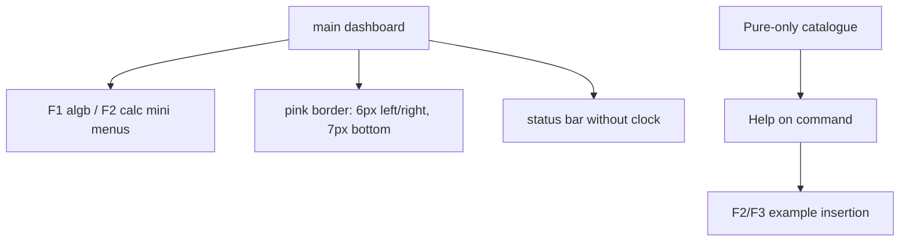
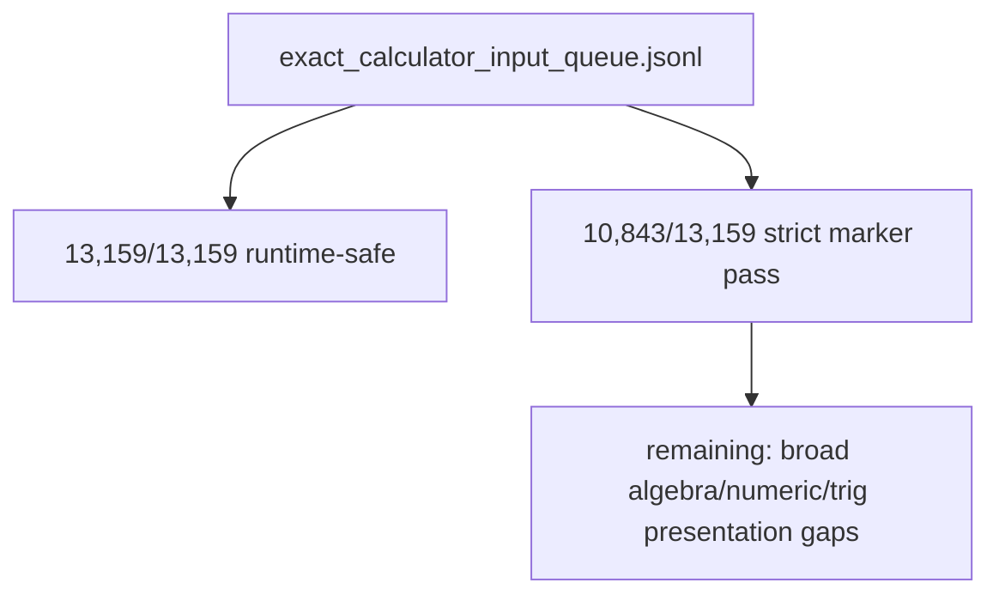

# Project Graph

Last updated: 2026-05-31 18:28 BST

## Build

```mermaid
graph TD
  Compile["./compile"] --> Build["tools/build_g3a.sh"]
  Build --> Docker["casio-khicas-source Docker image"]
  Docker --> Src["khicas/upstream/giac90_1addin"]
  Src --> Make["Makefile CAS.g3a target"]
  Make --> Bin["khicasen.bin, upstream KhiCAS base"]
  Bin --> G3A["calculator_files/CAS.g3a"]
  G3A --> Meta["CAS / @CAS / CAS.g3a"]
  G3A --> Size["2,090,516 bytes; 6,636 byte headroom"]
```

## Runtime

```mermaid
graph TD
  Input["console input"] --> Guard["cascas::eval_with_working"]
  Guard --> Work["known Pure working route"]
  Work --> Steps["exam lines"]
  Steps --> Console["Console_NewLine output"]
  Guard --> Fallback["unknown/plain input"]
  Fallback --> KhiCAS["original KhiCAS parser/evaluator"]
  KhiCAS --> Console
```

## Working Routes

```mermaid
graph TD
  Work["working engine"] --> Diff["diff: ln, polynomials, implicit, trig basics"]
  Work --> Int["integrate: term, reverse-chain, by-parts, substitution, trig, rational"]
  Work --> Solve["solve: linear, quadratic, rational, dy/dx separable, selected inequalities"]
  Work --> Alg["algebra: factor/expand high-frequency exam forms"]
  Work --> Num["method=numeric with safe scientific formatting"]
  Work --> Xform["xform trig/log identities"]
```

## UI

```mermaid
graph TD
  Console["main dashboard"] --> FMenu["F1 algb / F2 calc mini menus"]
  Console --> Border["pink border: 6px left/right, 7px bottom"]
  Console --> Status["status bar without clock"]
  Catalog["Pure-only catalogue"] --> Help["Help on command"]
  Help --> Examples["F2/F3 example insertion"]
```

## Queue Status

```mermaid
graph TD
  Queue["exact_calculator_input_queue.jsonl"] --> Runtime["13,159/13,159 runtime-safe"]
  Queue --> Strict["10,843/13,159 strict marker pass"]
  Strict --> Remaining["remaining: broad algebra/numeric/trig presentation gaps"]
```
