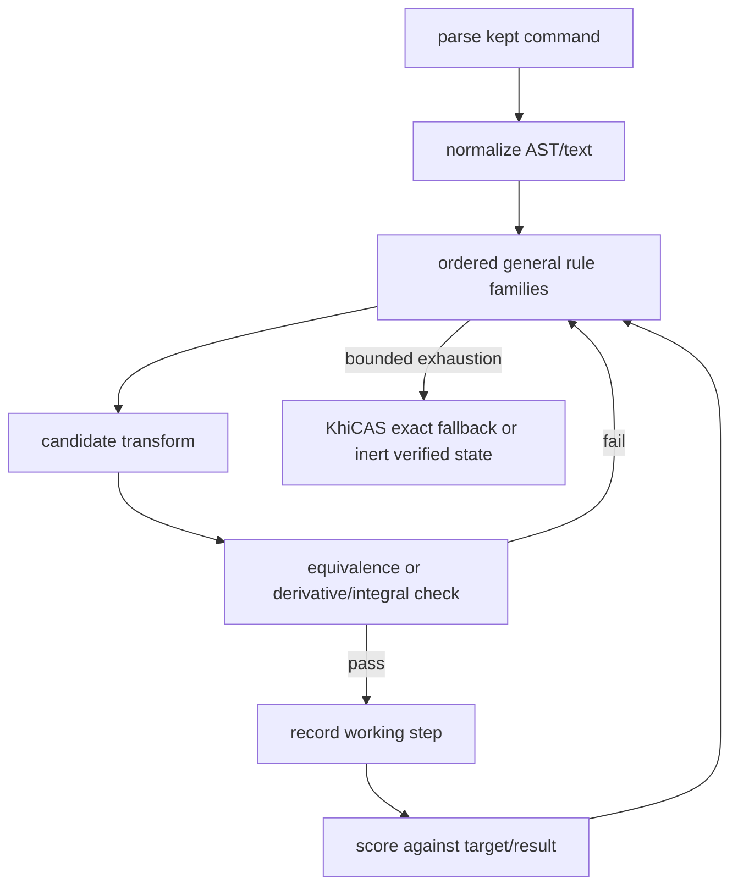

# CAS Planner References

Purpose: reusable design input only. Do not vendor large external engines into the calculator build.

## Sources Checked

| Project | License | Useful logic | Decision |
|---|---:|---|---|
| Google MathSteps | Apache-2.0 | ordered rule searches, tree traversal, change-type step records, max-step guard | copy architecture pattern, not JS code |
| Rubi | rule-based source available | decision tree of general integration rules, hole-finding by tests | use as integration-rule model only |
| SymPy | BSD-3-Clause | canonical CAS algorithms, equivalence checks, trig simplification, solve/factor/integrate checks | use host/reference checks and small generated rules |
| Nerdamer | MIT | modular parser/algebra/calculus/solve split | use modular surface idea only |
| MathHook | MIT OR Apache-2.0 | compact native AST, educational step records, bounded symbolic operations | use as confirmation for small verified-step architecture |

Links:
- https://github.com/google/mathsteps
- https://rulebasedintegration.org/
- https://docs.sympy.org/latest/modules/simplify/simplify.html
- https://docs.sympy.org/latest/modules/simplify/fu.html
- https://docs.sympy.org/latest/modules/calculus/index.html
- https://raw.githubusercontent.com/sympy/sympy/master/sympy/calculus/util.py
- https://nerdamer.com/
- https://mathhook.org/

## Range Algorithm Note

SymPy `function_range` uses continuous-domain splitting, endpoint limits, and derivative critical points. For the calculator build, use compact A-level subsets of that pattern:
- for rational `num/den`, form `den*y-num=0`
- solve the discriminant condition in `y`
- separately check degenerate leading-coefficient cases
- only display backend-solved/verifiable conditions

## Trig Algorithm Note

SymPy Fu's TR10/TR12 style compound-angle transforms use general identity
families rather than exact problem routes. For the calculator build, keep the
same idea in a much smaller form: split a trig argument at the last top-level
`+`/`-`, build the compound-angle candidate, and display it only after
`khicas_equiv` accepts it.

## Implementation Contract

Rules:
- bounded loop and complexity guard
- no exact input route branches
- each displayed transform must be checked where possible
- fallback must not call expensive exact simplification for inert nested forms
- source references inform algorithms; copied code requires license attribution and size budget
