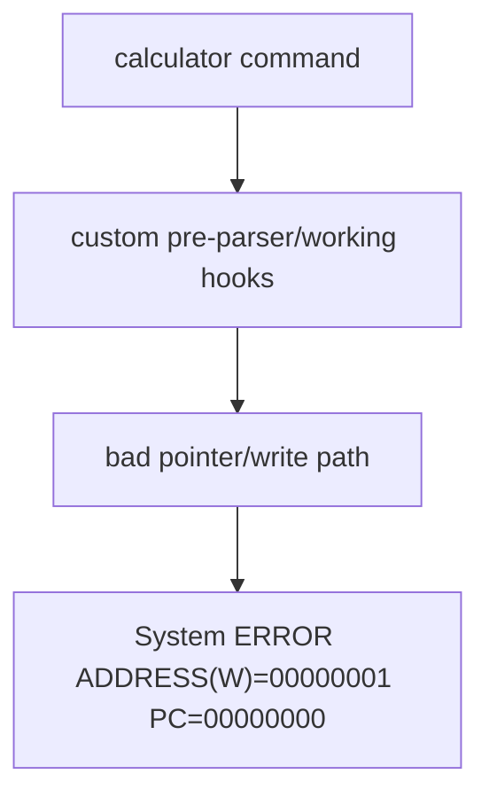
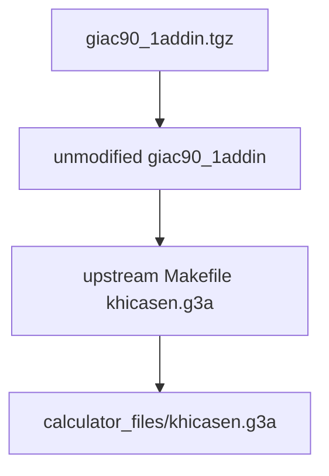

# KhiCASen Runtime Difference Audit

Scope: differences that could cause calculator startup/runtime faults.

## Crash Path

Fix path:

## Difference Checklist

| Area | Broken project state | Upstream `khicasen` state now | Crash relevance |
| --- | --- | --- | --- |
| source archive | `khicas.tgz` / `kupdate.tgz` newer split tree | `giac90_1addin.tgz` | high |
| executable target | `khicas50.g3a` | `khicasen.g3a` | high |
| sidecar target | `khicas50.ac2` copied | no `.ac2` output | high |
| RAM-part loader | active package depended on external RAM file | monolithic calculator package | high |
| output filename | `CasioCAS.g3a` | `khicasen.g3a` | medium |
| internal name | `@CASCAS` | `@KHICASEN` | medium |
| basic name | `CasioCAS` | `Khicasen` | low |
| metadata patch | post-build binary mutation | no binary mutation | medium |
| help pack | external `CASIOCAS.PAK` | no external pack | medium |
| source edits | many A-level patches | upstream plus small guarded working hook | medium |
| `main.cc` | custom session/menu/working behaviour | one guarded hook before upstream `run()` | medium |
| `console.cc` | custom fallback/output handling | upstream plus newline-safe working output and built-in F-menu labels | high |
| `graphicsProvider.cpp` | broad custom graphics edits | one direct border function | medium |
| catalog | old broad prune/rewire | Pure-only visible catalogue | medium |
| parser/lexer | removed-feature guards | upstream | high |
| evaluator tables | renamed/stubbed commands | upstream | high |
| working engine | broad `cascas_working` routes | small exact-route `cascas_working` | medium |
| host bridge | calculator source shared with host tests | absent | medium |
| function keys | custom labels/colours/examples | upstream | medium |
| sessions | patched around save/load | upstream `restore_session`/`save_session` | medium |
| scripts | disabled in custom tree | upstream | low |
| build flags | custom added guards/sections in some phases | upstream flags | high |
| linker script | split/source drift risk | upstream `prizm.ld` | high |
| `iostream` | was accidentally missing after cleanup | restored symlink to `iostream.new` | medium |
| transfer folder | mixed `.g3a/.ac2/.PAK` | only `khicasen.g3a` | high |

## Current Residual Differences From Archive

- Generated empty archive artifact `testv.882` is not kept.
- Build outputs are cleaned after compile.
- Docker toolchain wraps the upstream `Makefile`; it does not rewrite source or metadata.
- `cascas_working` handles only exact safe Pure routes and otherwise falls through.
- Working lines are emitted one console line at a time with `Console_NewLine`.
- `FMENU.cfg` on flash is ignored to avoid stale custom labels from older builds.
- About/shortcuts strings are shortened for ROM headroom.
- Catalogue/menu now hide non-Pure commands instead of hard-pruning evaluator support.
- `xform` and `log(base,x)` are added to the visible catalogue and editor colour path.
- `drawCasioCasBorder()` draws 6 px left/right and 7 px bottom border after display flush.
- Clock text is removed from the top status bar.
- Full exact queue runtime run passes `13,116/13,116`; strict expected-marker run is `319/13,116`.

## Rule Before Reintroducing A-Level Work

Only add one calculator-facing change at a time:

1. compile
2. copy `calculator_files/khicasen.g3a`
3. run real calculator smoke test
4. commit only after no crash

Smoke test:

- launch app
- enter `99999`
- enter `2+3`
- enter `integrate(9*x,x)`
- enter `diff(x^2,x)`
- open catalog/function keys
