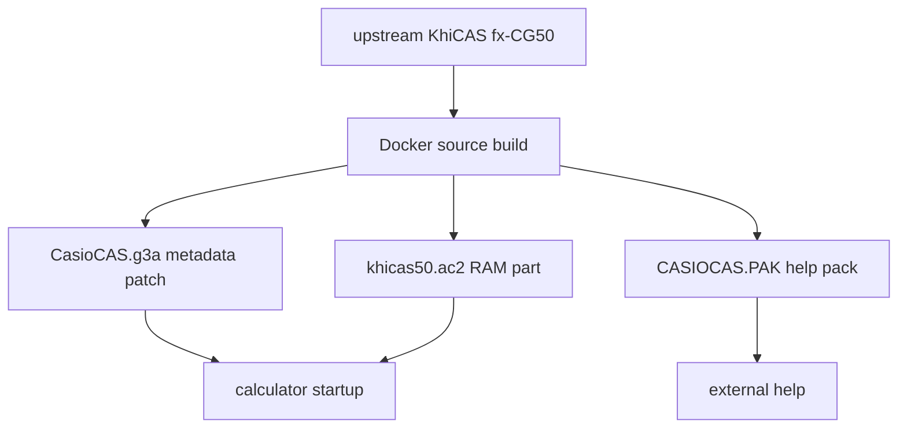

# Runtime Risk Audit

## Change Groups Since Upstream

- Repo reset: old files archived in Git, fresh upstream source imported.
- Build: Docker toolchain, `./compile`, metadata patch, size checks, `calculator_files/` transfer outputs.
- Packaging: renamed visible add-in to `CasioCAS.g3a`; upstream RAM part remains `khicas50.ac2`.
- Scope: `CASCAS_ALEVEL_ONLY` removes/stubs non-pure features: stats/probability, matrices, plotting, geometry, turtle/pixels, complex-only, crypto, programming/Python/scripts, sessions, about/shortcuts, mechanics.
- Catalog/help: reduced command list to pure maths, external `CASIOCAS.PAK`, one help sheet per function, F2/F3 example insertion.
- UI: restored purple border.
- Working: added same-source `cascas_working` layer, host runner uses same source, golden queue checks same source.
- Feature polish: exact/domain/range/log/trig/xform/implicit/parametric/integration working routes.
- Tests/tools: restored old golden queue; added host shared-core checks and scope/removed-feature gates.

## Risk Findings

- **Fixed critical:** upstream fx-CG50 complete version requires `khicas50.g3a` + `khicas50.ac2`; current package copied only `.g3a` and `.PAK`. Startup then failed with `Fatal: unable to load ram part khicas50.ac2 err=2`.
- **Fixed high:** catalog F2/F3 examples were stored as full commands without upstream `#` exact-insert marker, causing nested inserts such as `abs(abs(-3))`.
- **Medium:** metadata rename changes visible/internal add-in name; low risk if sidecar keeps upstream filename because `ram_filename` is hardcoded as `\\fls0\khicas50.8c2`.
- **Medium:** hard pruning can break hidden dependencies; mitigated by compile, removed-feature scans, and host working tests.
- **Medium:** external help pack can be missing; calculator should still run, but help detail will be unavailable.
- **Low:** purple border touches display refresh paths; covered by border checker and manual UI risk remains on real hardware.
- **Low:** same-source working routes are pattern-heavy; unsupported/generic fallback checks reduce drift but do not prove every pure expression.

## Transfer Rule

Copy all generated files from `calculator_files/` to calculator storage root:

- `CasioCAS.g3a`
- `khicas50.ac2`
- `CASIOCAS.PAK`

Do not rename `khicas50.ac2`.
