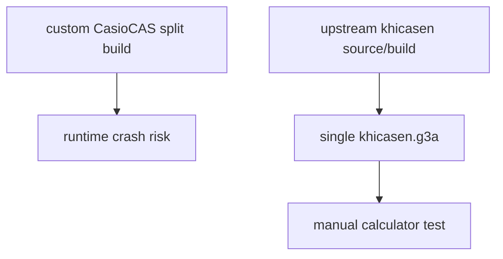

# Runtime Risk Audit

Observed calculator crash:

- `System ERROR`
- `ADDRESS(W) TARGET=00000001`
- `PC=00000000`

Decision:

## Removed From Calculator Binary

- `khicas50.g3a`
- `khicas50.ac2`
- `CasioCAS.g3a` metadata rewrite
- `CASIOCAS.PAK`
- external catalog/help rewrites
- purple border patch
- removed-feature guards
- host-only bridge hooks
- custom F-key colour edits and stale `FMENU.cfg` loading
- session/script disabling patches
- parser/evaluator prune patches

## Kept

- upstream `giac90_1addin.tgz` source
- upstream `Makefile`
- upstream `prizm.ld`
- upstream `khicasen.g3a` target
- upstream metadata: `Khicasen`, `@KHICASEN`, `khicasen.g3a`
- upstream icons: `khicasio.png`, `khicasio1.png`
- upstream UI behaviour, except stale `FMENU.cfg` is ignored so old bad labels cannot persist

## Reintroduced With Guard

- `cascas_working.o` is linked into the monolithic `khicasen.g3a`.
- It is called once from the main input loop.
- It returns `false` for numeric literals, bad delimiters, and unknown input.
- Unknown input falls through to original KhiCAS unchanged.
- Working text is split through `Console_NewLine`; no embedded newline is passed to `Console_Output`.
- `FMENU.cfg` on flash is ignored; built-in labels are `algb/calc/trig/menu/A<>a/solve`.
- Current direct routes: `integrate(9x)`, simple diff/int/range/log/xform, and the implicit diff example.
- About/shortcuts text was shortened to reclaim ROM; no control-flow change.
- The visible catalogue is Pure-only; unsupported command support is hidden, not hard-pruned.
- `xform` and `log(base,x)` are visible in the catalogue and manually syntax-coloured.
- Pink border is drawn through `drawCasioCasBorder()` after screen flush: 6 px sides, 7 px bottom, no top.
- Top status bar no longer includes the clock.

## Risk List

| Difference | Previous Project | KhiCASen Baseline | Risk |
| --- | --- | --- | --- |
| Source archive | `khicas.tgz` split build | `giac90_1addin.tgz` | wrong base |
| Add-in file | `CasioCAS.g3a` | `khicasen.g3a` | metadata/session mismatch |
| Sidecar | `khicas50.ac2` required | none required | missing/wrong RAM part |
| Metadata | patched to `CasioCAS/@CASCAS` | upstream `Khicasen/@KHICASEN` | loader/UI mismatch |
| Build target | `khicas50.g3a khicas50.ac2` | `khicasen.g3a` | wrong linker/object path |
| External pack | `CASIOCAS.PAK` | none | file lookup drift |
| Working engine | broad custom `cascas_*` | small guarded hook | medium |
| Function keys | custom colours/examples | upstream | UI register/state drift |
| Border | old custom draw patches | direct `drawCasioCasBorder()` only | low/medium |
| Feature pruning | many stubs/guards | catalogue/menu hide only | low |

## Verification

- `./compile` succeeds.
- `calculator_files/` contains only `khicasen.g3a`.
- Metadata check passes: `Khicasen`, `@KHICASEN`, `khicasen.g3a`.
- Size is `2,075,004` bytes, under fx-CG add-in hard limit.
- Catalogue scope check passes.
- Border source check passes.
- Exact queue runtime pass: `13,116/13,116`.
- Strict marker pass: `319/13,116`; remaining failures are missing dedicated working routes, not runtime crashes.

Manual calculator test needed because this machine cannot emulate fx-CG50 hardware faults reliably.
