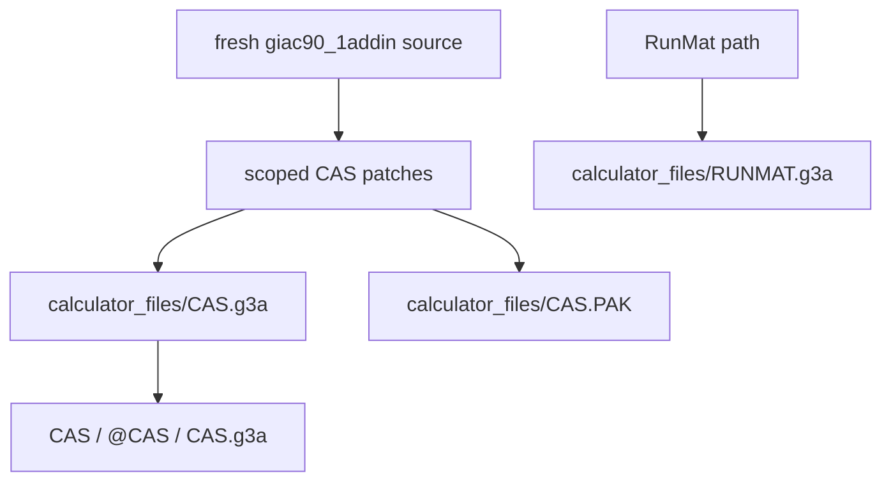

# Runtime Risk Audit

Current build target:



## Current Metadata

- CAS add-in: `calculator_files/CAS.g3a`
- CAS metadata: `CAS`, `@CAS`, `CAS.g3a`
- CAS size: 2,096,992 bytes, 160 bytes under the 2,097,152-byte limit.
- CAS SHA256: `3856132726e1d2fa7786fd45a9ba161cc75007aa212f3226fcafe6f97af8c597`
- Help pack: `calculator_files/CAS.PAK`
- Help pack size: 18,515 bytes.
- Help pack SHA256: `b816944d708f90aa8d922f7657d47f482d4eb5060f594a6cd2ce9ece9104a533`
- RunMat add-in: `calculator_files/RUNMAT.g3a`
- RunMat metadata: `RunMat`, `@RUNMAT`, `RUNMAT.g3a`
- RunMat SHA256: `084e197a81a047efbabaff2d2c051c5fab4c2180667967074f7075665ad39d70`
- Deterministic `.g3a` timestamp: `2000.0101.0000`

## Runtime Guards

- Source-built `.g3a`; no binary patching as final output.
- `CAS.g3a` must stay below `2,097,152` bytes.
- Removed features must be absent from catalog/help and rejected at direct input.
- Stats/probability/matrices/program/turtle/graph/crypto remain out of scope.
- Probability/distribution runtime code is stubbed under the source build flag; `binomial(n,k)` remains available for A-level algebra/binomial expansion.
- Pathological generated inputs must return bounded fallback text instead of hanging.
- Final `.g3a` outputs are normalized by `tools/normalize_g3a_metadata.py` after source packaging.
- Working output is routed through guarded CAS working code, then original KhiCAS fallback.
- Every displayed working route must carry a verification marker where possible.
- Live calculator/source tooling no longer emits `no route`, `route failed`, or `No verified A-level working route found` wording for kept-command paths.
- Pink border is drawn by `drawCasioCasBorder()` after console flush.
- Catalog UI delegates to `doMenu(&menu)` and uses status/menu draw paths; the border owner is the console flush path.

## Manual Smoke Status

Previously passed in fx-CG Manager emulator/background automation:

- Replaced emulator SD-card `CAS.g3a`, `CasioCAS.g3a`, and `CAS.PAK` with then-current artifacts.
- 2026-06-09 artifacts above still need foreground emulator or hardware smoke after transfer.
- Memory Manager UI remains responsive after import cancellation and returns to the Memory Manager screen.
- Main menu navigation can select `CasioCAS` by D-pad and open a CAS session. Screenshot: `/tmp/casio-smoke-current/casiocas_dpad_launch_final.png`.

Previously passed with an older artifact:

- Imported an older `calculator_files/CAS.g3a` through Memory Manager -> Import/Export -> Import files and saved it to calculator main memory.
- Restarted fx-CG Manager hidden and advanced the license wizard without foregrounding Codex.
- Opened the emulator main menu and selected the visible `CAS` add-in through keyboard navigation.
- Reached the CAS session UI and executed simple key/text entry smoke.
- Removed-command smoke through GUI text entry produced non-echo/non-simplified output for `stats(1,2,3)`; production host runner returns `Err: unsupported`.

Covered by production host runner, not manual text entry:

- `xform((cos(x)+sin(x))*(cosec(x)-sec(x))=k*cot(2*x),k)` returns `k = 2` with verification.
- Removed commands reject: `stats(1,2,3)`, `matrix([[1]])`, `plot(sin(x),x)`, `rand()`, `normal(0,1)`.
- Long generated input rejects by complexity guard.

Still needed on hardware or foreground manual calculator key entry:

- Help open.
- Long input through calculator keys.
- xform through calculator keys.
- Confirm removed-command wording through physical keys, because background text injection can drop/transform characters.

Latest background attempts:

- 2026-06-07: CuaDriver background clicks/key events did not reach the fx-CG Manager calculator core while the emulator was on the Help screen.
- Current emulator Help screen reported `Copy CASIOCAS.HLP to storage root.`
- 2026-06-07: Current artifacts were copied to emulator SD-card and fx-CG Manager was restarted hidden.
- SD-card hashes from the pre-fix artifact matched `CAS.g3a` and `CasioCAS.g3a` at `22fd95bace75ee6cc2172eb57471dbc711d08a50148d8fbd028bc8d7319151cb`; the previous route-family artifact is `beff681c3c1109fdfeb7aa595b5d2f9320bfe7ebbe0de9c04450cf0d873b4639`; the current endpoint-range candidate is `81d23a9898e012137a53f4c6deb2b09aca14342a0a05f37c0f476b7af9fb2590`.
- Backup of previous SD-card add-ins: `/tmp/casio-smoke-current/emulator-sdcard-backup-20260607-034135`.
- App-level open/import of `calculator_files/CAS.g3a` reported `The document "CAS.g3a" could not be opened.`
- The documented Memory Manager import path succeeded afterward; screenshots are under `/tmp/casio-smoke-current/after_axopen_cas.png`, `/tmp/casio-smoke-current/after_import_exe.png`, `/tmp/casio-smoke-current/main_after_import.png`, and `/tmp/casio-smoke-current/cas_launch_after_import.png`.
- Main-memory emulator files were backed up before that attempt at `/tmp/casio-smoke-current/emulator-mainmem-backup-20260607-040911`.
- 2026-06-07 current-artifact Memory Manager import retry reached the macOS Open panel, but the panel disabled `.g3a` and `.PAK` file choices. The panel was cancelled and the emulator returned to Memory Manager. Screenshot: `/tmp/casio-smoke-current/after_cancel_current.png`.
- 2026-06-07 current SD-card artifacts were refreshed to `81d23a9898e012137a53f4c6deb2b09aca14342a0a05f37c0f476b7af9fb2590`; backup: `/tmp/casio-smoke-current/emulator-sdcard-backup-20260607-082738`.
- 2026-06-07 current SD-card artifacts were refreshed again to `e9d6f653d66fee67582702df1fd5b0988ca0f73dc2c4299d24e0d2cc1d68fb3b`; `CAS.PAK` matched `052c840eda857b109282acae7768ed5bbabcf7e5a4478d2847aadab2152af398`.
- 2026-06-07 the already-running add-in still showed stale `2+2 -> "// Error: Bad Argument Type"` output after the SD refresh, proving it was old code in RAM. Screenshot: `/tmp/casio-smoke-current/current_after_refresh.png`.
- 2026-06-07 app-level launch with current `calculator_files/CAS.g3a` did not reload the running app; forced new instance showed `The application is already running.` Screenshot: `/tmp/casio-smoke-current/new_instance_open_cas.png`.
- 2026-06-07 background attempts to open the calculator main menu or toolbar `Main Memory R/W`/`Record` routes did not produce a fresh current-artifact launch; CuaDriver daemon was stopped afterward.
- 2026-06-07 previous SD-card `CasioCAS` launch via D-pad opened a CAS session. The current refreshed artifact still needs foreground/hardware launch smoke.
- 2026-06-07 background `press_key` reached the CAS session and evaluated numeric input. `2`, `2`, `enter` produced a verified visible working screen for `22`. Screenshot: `/tmp/casio-smoke-current/presskey_2p2.png`.
- 2026-06-07 frontmost emulator `System Events` key-code entry evaluated compound arithmetic. `2+2` produced `4`. Screenshot: `/tmp/casio-smoke-current/systemevents_2p2.png`.
- 2026-06-07 function-name entry remains unreliable through automation. Typing the required long `xform(...)` expression reduced to `xx`; clipboard paste and calculator `PASTE` did not insert text; catalog search accepted only partial letter input. Screenshots: `/tmp/casio-smoke-current/systemevents_xform.png`, `/tmp/casio-smoke-current/clipboard_2p2.png`, `/tmp/casio-smoke-current/calc_paste_2p2.png`, `/tmp/casio-smoke-current/catalog_x_retry.png`.
- 2026-06-07 post-full-gate rerun screenshot `/tmp/casio-smoke-current/current_window_latest.png` confirms the visible emulator session is still a stale in-RAM add-in: plain arithmetic still shows `"// Error: Bad Argument Type"` despite current host/source artifact passing.
- 2026-06-07 CuaDriver point-coordinate key clicks reached calculator UI, but the attempted clear/Menu path opened the in-addin catalog instead of a fresh add-in launcher. Screenshot: `/tmp/casio-smoke-current/after_ac_menu_try_points.png`.
- 2026-06-07 CuaDriver daemon was stopped after the manual attempt.
- 2026-06-07 after the generic xform/log-law fallback change, current SD-card aliases `CAS.g3a`, `CasioCAS.g3a`, and `khicasen.g3a` were refreshed to SHA256 `249b2bf7180777ac630ebca13ddeb174f3d679b9b2f725312961403cb9438dcd`; `CAS.PAK` stayed `052c840eda857b109282acae7768ed5bbabcf7e5a4478d2847aadab2152af398`.
- 2026-06-07 after the generic range/implicit route change, current SD-card aliases `CAS.g3a`, `CasioCAS.g3a`, and `khicasen.g3a` were refreshed to SHA256 `7ecf439d6871214b50b875c760faf2499c479763fa2237c6f69feb1c9802c34c`; `CAS.PAK` stayed `052c840eda857b109282acae7768ed5bbabcf7e5a4478d2847aadab2152af398`.
- 2026-06-07 after the implicit product/log-domain filtering change, current SD-card aliases `CAS.g3a`, `CasioCAS.g3a`, and `khicasen.g3a` were refreshed to SHA256 `ab5969e0f2c54cc6fc7c503e7437c5d8495e7d07549d7aa49ce52be595327df9`; `CAS.PAK` stayed `052c840eda857b109282acae7768ed5bbabcf7e5a4478d2847aadab2152af398`.
- 2026-06-07 continuation smoke reached the in-emulator Main Menu without restarting fx-CG Manager, then attempted to launch the visible `CasioCAS` add-in. The CAS session still showed stale arithmetic behavior (`2+2 -> "// Error: Bad Argument Type"`), so current-artifact UI smoke remains blocked on a real add-in reload/restart or hardware install. Screenshots: `/tmp/casio-smoke-current/after_menu_click_reload_attempt.png`, `/tmp/casio-smoke-current/after_launch_casiocas_current_attempt.png`.
- 2026-06-07 after planner rule-ordering and identity-precedence changes, current SD-card aliases `CAS.g3a`, `CasioCAS.g3a`, and `khicasen.g3a` were refreshed to SHA256 `bda56a68bfbb7d67988bd87ce44539183476ed0239d9417098d8471ea2b8b2b9`; `CAS.PAK` stayed `052c840eda857b109282acae7768ed5bbabcf7e5a4478d2847aadab2152af398`.
- Next manual smoke should key-enter long/xform examples on foreground emulator or hardware.

## Verification Commands

```sh
./compile
python3 tools/check_g3a_size.py calculator_files/CAS.g3a
python3 tools/check_g3a_metadata.py calculator_files/CAS.g3a --name CAS --internal @CAS --filename CAS.g3a
python3 tools/check_g3a_metadata.py calculator_files/RUNMAT.g3a --name RunMat --internal @RUNMAT --filename RUNMAT.g3a
python3 tools/check_calculator_border.py
python3 tools/check_removed_features.py
python3 tools/check_catalog_scope.py
python3 tests/check_shared_working.py
python3 tests/run_exact_queue.py --engine production --strict-markers --workers 2
python3 tests/random_working_fuzzer.py --per-function 20 --strict --timeout 10 --seed 60606 --jsonl tests/reports/random_working_fuzzer_per_function_latest.jsonl --transcript tests/reports/random_working_fuzzer_per_function_latest.txt --print-failures
```
